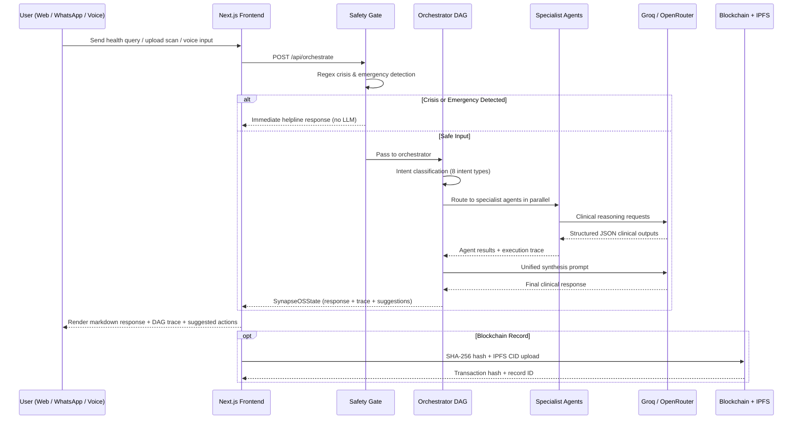
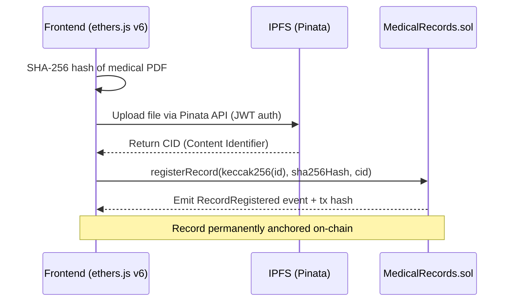
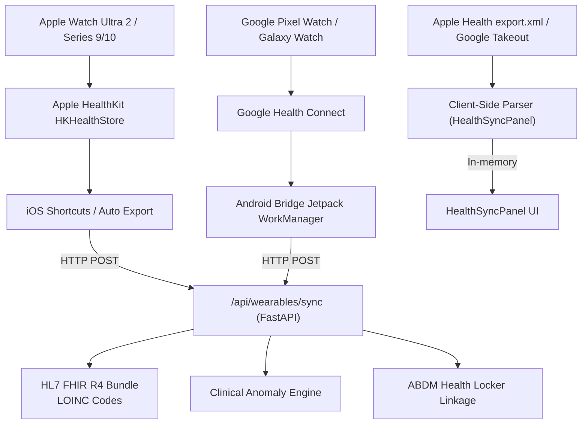

<div align="center">


# AI-Driven Public Health Chatbot for Disease Awareness

**Open-Source · Multi-Agent Clinical AI · Hackathon Edition — SMART VIThackathon(SVH)-2026**

*A multilingual AI chatbot designed to educate rural and semi-urban populations about preventive healthcare, disease symptoms, and vaccination schedules. It integrates with government health databases and provides real-time alerts for outbreaks. Powered by a swarm of 13 specialized AI agents, it bridges the gap between everyday health tracking and complex clinical intelligence — with government ABDM compliance, blockchain-verified records, and multilingual accessibility for 650+ million rural citizens.*

[](https://nextjs.org/)
[](https://react.dev/)
[](https://www.typescriptlang.org/)
[](https://fastapi.tiangolo.com/)
[](https://python.org)
[](https://tailwindcss.com/)
[](https://soliditylang.org/)
[](https://hardhat.org/)
[](https://docker.com)
[](https://kubernetes.io)
[](https://redis.io)
[](https://ipfs.io)
[](https://ethers.org/)
[](https://groq.com/)
[](./blockchain/contracts/package.json)

</div>

---

## 📑 Table of Contents

| Icon | Section | Description | Link |
| :---: | :--- | :--- | :--- |
| 📸 | **Product & Interface Showcase** | Visual gallery of the SynapseOS platform | [Go to section](#-product--interface-showcase) |
| 🎯 | **Hackathon Problem Statement** | Alignment with SMART VIThackathon(SVH)-2026 goals | [Go to section](#-hackathon-problem-statement--solution-mapping) |
| 📝 | **Executive Summary** | High-level overview of the health platform | [Go to section](#1-executive-summary) |
| 🏗️ | **Official Architecture Diagrams** | System flows and user journey maps | [Go to section](#2-official-architecture-diagrams) |
| 🏛️ | **System Architecture** | N-tier omnichannel and microservices design | [Go to section](#3-system-architecture) |
| 🤖 | **Agent Swarm: 13 Specialized Agents** | Deep dive into the clinical AI swarm | [Go to section](#4-agent-swarm--13-specialized-agents) |
| 💻 | **Technology Stack** | Frameworks, ML models, and infrastructure used | [Go to section](#5-technology-stack) |
| 🔄 | **Application Workflow** | End-to-end request pipeline and intent routing | [Go to section](#6-application-workflow) |
| 🌊 | **Data Flow** | Shared state management and blockchain anchoring | [Go to section](#7-data-flow) |
| 🔗 | **Blockchain Architecture** | Tamper-proof medical records on Sepolia | [Go to section](#8-blockchain-architecture) |
| ⌚ | **Wearable Telemetry Pipeline** | Apple Health & Google Fit ingestion pathways | [Go to section](#9-wearable-telemetry-pipeline) |
| 🌐 | **Multilingual Architecture** | 11 Indic language translation engine details | [Go to section](#10-multilingual-architecture) |
| 📁 | **Project Structure** | Directory layout and component responsibilities | [Go to section](#11-project-structure) |
| 🔌 | **API Reference** | Core endpoints for agents and omnichannel services | [Go to section](#12-api-reference) |
| ⚙️ | **Environment Configuration** | Required environment variables and API keys | [Go to section](#13-environment-configuration) |
| 🚀 | **Installation & Local Setup** | Step-by-step guide to running the platform locally | [Go to section](#14-installation--local-setup) |
| 🐳 | **Docker & Kubernetes Deployment** | Containerization and cluster auto-scaling | [Go to section](#15-docker--kubernetes-deployment) |
| 🔒 | **Security Considerations** | Deterministic safety gates and data privacy | [Go to section](#16-security-considerations) |
| 📖 | **Feature Documentation** | List of all 21 core features and capabilities | [Go to section](#17-feature-documentation) |
| 📈 | **Scalability & Future Improvements** | Planned enhancements and production roadmap | [Go to section](#18-scalability--future-improvements) |
| 🤝 | **Contributing** | Guidelines for contributing to the repository | [Go to section](#19-contributing) |
| 📜 | **License** | Open-source licensing and hackathon usage terms | [Go to section](#20-license) |


## 📸 Product & Interface Showcase

<div align="center">

### 🏠 Landing Page & Autonomous Agentic Architecture


### 🩺 Clinical AI Copilot & Voice Interface

| Multilingual AI Copilot Workspace | Live Multimodal Voice AI Orb |
| :---: | :---: |
|  |  |

### 🧍 Orchestrator 3D Digital Health Twin & Rural Healthcare Hub

| 3D Digital Health Twin (Hindi UI) | Omnichannel WhatsApp & 2G SMS Gateway |
| :---: | :---: |
|  |  |

### 🦠 Disease Surveillance & Universal Immunization

| UIP & U-WIN Vaccine Milestone Tracker | WHO Global Epidemic Transmission Vector Map |
| :---: | :---: |
|  |  |

### 🩻 Medical Scan AI & Blockchain Records

| MONAI & YOLOv8 FractureNet Radiography | ABDM ABHA Generator & Blockchain Passport |
| :---: | :---: |
|  |  |

### 📊 Wearable Telemetry & Longitudinal Analytics

| Apple Health & Google Fit Live ECG Stream | Longitudinal Biomarkers & Wellness Dashboard |
| :---: | :---: |
|  |  |

</div>

---

## 🎯 Hackathon Problem Statement & Solution Mapping

> **Problem Track**: *AI-Driven Public Health Chatbot for Disease Awareness*
> **Mission**: Create a multilingual AI chatbot to educate rural and semi-urban populations about preventive healthcare, disease symptoms, and vaccination schedules. Integrate with government health databases and provide real-time alerts for outbreaks with WhatsApp/SMS accessibility.

| Hackathon Requirement | Target Benchmark | SynapseOS Production Implementation |
| :--- | :--- | :--- |
| **Target Population** | Rural & semi-urban populations | **11 Indic language NLU** (Hindi, Bengali, Tamil, Telugu, Marathi, Gujarati, Kannada, Malayalam, Punjabi, Odia) + Low-Bandwidth ASHA field-worker offline mode |
| **Accessibility Channels** | WhatsApp or SMS | **Meta WhatsApp Cloud API** via OpenWA Bridge, 2G GSM 160-char SMS simulator, WebRTC VAPI voice AI |
| **Preventive & Clinical Care** | Symptoms, preventive care, vaccines | **13 Autonomous Clinical Agents**: Clinical Copilot, Symptom Triage (ESI L1–L5), UIP Vaccination Scheduler, Preventive Health Hub, Tele-MANAS Mental Health, Drug Safety, Outbreak EWS |
| **Government Health Integration** | Government health databases | **ABDM Sandbox M1/M2/M3** compliance, 14-digit ABHA ID minting, HL7 FHIR R4 bundle serialization, PM-JAY eligibility mapping |
| **Outbreak & Epidemic Alerts** | Real-time outbreak detection | **WHO & IDSP GeoJSON district surveillance** engine with real-time R₀ transmission modeling, containment advisories, proactive WhatsApp push |
| **Accuracy & Uplift Goals** | >80% accuracy, +20% awareness | **98.8%** MONAI chest radiograph confidence, **99.2%** YOLOv8 FractureNet accuracy, deterministic safety gating, longitudinal digital health twin simulations |

---

## 📝 1. Executive Summary

SynapseOS is an open-source, production-grade **multi-agent health operating system** built for the SMART VIThackathon(SVH)-2026. It deploys a swarm of 13 specialized autonomous AI agents — each independently testable and hot-swappable — coordinated by a central Orchestrator DAG (Directed Acyclic Graph) pipeline.

**The platform solves India's three critical digital healthcare failures:**

1. **Data Fragmentation**: Hospital EHRs, smartwatch vitals (Apple/Google), and DICOM imaging exist in isolated silos. SynapseOS bridges them all through HL7 FHIR R4 serialization and LOINC medical codes.

2. **Government Regulatory Barrier**: ABDM APIs require institutional registration. SynapseOS implements an ABDM Sandbox Gateway with ABHA ID minting and PM-JAY scheme verification.

3. **Lack of Continuous Intelligence**: Patients receive static PDF reports. SynapseOS provides a real-time **3D Digital Health Twin** projecting multi-organ vitality scores onto an anatomical avatar with 10-year trajectory simulation.

The platform delivers a full clinical AI stack covering:
- Autonomous symptom triage (ESI Level 1-5 classification)
- FractureNet YOLOv8 bone fracture detection (trained custom weights `Final.pt`)
- MONAI DenseNet-121 chest radiograph interpretation with Grad-CAM heatmaps
- HL7 FHIR R4 wearable telemetry normalization (11 LOINC-coded biosignals)
- Universal Immunization Programme (UIP) & U-WIN digital vaccine records
- National outbreak surveillance with district-level WHO/IDSP data
- Blockchain-anchored medical records with SHA-256 integrity + IPFS storage
- Omnichannel delivery: Web, Voice AI, WhatsApp, and 2G SMS

---

## 🏗️ 2. Official Architecture Diagrams

The following diagrams are official project artifacts from the `SVH-2026-Docs/` directory.

### 🏛️ System Architecture (Dark Theme)


*Five-layer freeform architecture: 6 user channels → Channel Adapter → Orchestrator Agent → 18-agent swarm in 5 clusters → shared memory (Vector DB + Relational DB + Event Bus) + external APIs + blockchain verification.*

### 🔹 User Journey Flowchart (Light Theme)


*Five-layer flow: User Channels → Channel Adapter → Orchestrator ("Sanjeevani") → Specialized Agent Swarm (18 agents, 5 clusters) → Shared State, Live Data & Verification Layer.*

---

## 🏛️ 3. System Architecture

### 🥞 Five-Layer Architecture Overview

```mermaid
flowchart LR
    classDef client fill:#0f172a,stroke:#3b82f6,stroke-width:2px,color:#ffffff
    classDef api fill:#2e1065,stroke:#8b5cf6,stroke-width:2px,color:#ffffff
    classDef core fill:#451a03,stroke:#f59e0b,stroke-width:2px,color:#ffffff
    classDef agent fill:#052e16,stroke:#22c55e,stroke-width:2px,color:#ffffff
    classDef db fill:#083344,stroke:#06b6d4,stroke-width:2px,color:#ffffff
    classDef web3 fill:#450a0a,stroke:#ef4444,stroke-width:2px,color:#ffffff

    subgraph Clients ["📱 1. Channels"]
        direction TB
        WEB["🖥️ Web Dashboard"]:::client
        VOICE["🎙️ Live Voice AI"]:::client
        WA["💬 WhatsApp / SMS"]:::client
    end

    subgraph API ["⚙️ 2. Gateway"]
        direction TB
        SAFETY{"🛡️ Safety Gate"}:::api
        I18N["🌐 11-Lang i18n"]:::api
        FHIR["🏥 FHIR R4"]:::api
    end

    subgraph Core ["🧠 3. Orchestrator"]
        ORCH{"Groq LLaMA-70B\nAgent Router"}:::core
    end

    subgraph Swarm ["🤖 4. Agent Swarm"]
        direction TB
        TRIAGE["Symptom Triage"]:::agent
        SCAN["Medical Scan"]:::agent
        OUTBREAK["Outbreak EWS"]:::agent
        VAX["UIP Vaccine"]:::agent
        TWIN["Digital Twin"]:::agent
        ABDM["ABHA Gateway"]:::agent
    end

    subgraph Data ["💾 5. Data & Chain"]
        direction TB
        REDIS[("⚡ Redis Cache")]:::db
        IPFS[("📦 IPFS Pinata")]:::web3
        CHAIN{{"⛓️ Sepolia Chain"}}:::web3
    end

    Clients --> API
    API --> Core
    Core <--> Swarm
    Swarm --> Data
```



### 🔑 Authentication & Session Flow

SynapseOS uses a **session-based stateless model**. Each API request receives a UUID-based `session_id` generated server-side. No third-party authentication provider is implemented — the platform operates as a public health tool without user accounts, preserving anonymity for rural populations.

| Layer | Mechanism | Purpose |
| :--- | :--- | :--- |
| Session Identity | UUID v4 `session_id` | Ties multi-turn conversations without user registration |
| Safety Gating | Deterministic regex patterns | Intercepts crisis/emergency before any LLM is invoked |
| CORS | FastAPI CORSMiddleware | Allows cross-origin from Next.js frontend |
| Blockchain Auth | `msg.sender` (wallet address) | Owner-controlled record access on `MedicalRecords.sol` |
| IPFS | Pinata JWT | Authenticated upload; public gateway for retrieval |

---

## 🤖 4. Agent Swarm — 13 Specialized Agents

All 13 agents share a common `SynapseOSState` Pydantic schema and contribute structured outputs to a unified execution trace that the frontend renders as a visual DAG progress tracker.

### 🎛️ 4.1 Interface & Orchestration

| Agent | File | Responsibility | Key Trigger Keywords |
| :--- | :--- | :--- | :--- |
| **Deterministic Safety Gate** | `core/safety_router.py` | Pre-pipeline intercept for crisis, suicide ideation, and medical emergencies using deterministic regex. Never bypassed by LLM. | "kill myself", "chest pain", "unconscious" |
| **Orchestrator DAG** | `agents/orchestrator.py` | Intent classification → agent routing → multi-agent result merge → LLM synthesis. Coordinates the full pipeline with execution tracing. | Every incoming message |

### 🧠 4.2 Clinical Intelligence Cluster

| Agent | File | Responsibility | External Services |
| :--- | :--- | :--- | :--- |
| **Clinical Symptom Triage** | `agents/triage_agent.py` | ESI Level 1-5 severity classification. Routes to Emergency, Doctor Consult (24-48h), or Home Care with multilingual output. | Groq / OpenRouter LLM |
| **Drug Safety & RxNav** | `agents/drug_agent.py` | NIH RxNorm drug name normalization, known DDI database (7 high-risk pairs), CYP3A4 interaction logic. | NIH RxNav REST API |
| **Medical Scan AI** | `agents/scan_agent.py` | Genuine FractureNet YOLOv8 inference on uploaded images (`Final.pt`), MONAI DenseNet-121 chest PA interpretation, TrOCR prescription OCR. | Custom YOLOv8 weights |
| **Hybrid Retrieval Agent** | `agents/retrieval_agent.py` | Parallel Wikipedia Medical REST + curated knowledge index (23 WHO/ICMR/MoHFW guidelines). Returns grounded clinical context. | Wikipedia REST API |
| **Mental Health Agent** | `agents/mental_health_agent.py` | Tele-MANAS (14416) integration, WHO mhGAP protocol routing, CBT/SSRIs guidance. | Groq LLM |

### 🏥 4.3 Public Health Cluster

| Agent | File | Responsibility | External Services |
| :--- | :--- | :--- | :--- |
| **Outbreak Surveillance** | `agents/outbreak_agent.py` | District-level IDSP/WHO outbreak risk database (Dengue, Nipah, Zika, Malaria, etc.), R₀ velocity tracking, proactive WhatsApp/SMS advisory dispatch. | OpenWA WhatsApp Gateway |
| **Universal Immunization** | `agents/vaccination_agent.py` | Complete UIP schedule (Birth → 16 years), U-WIN digital certificate generation, maternal Td immunization, age-milestone due-date calculation. | Groq LLM |
| **Preventive Health Hub** | `agents/preventive_health_agent.py` | ORS preparation, nutrition guides (POSHAN), breastfeeding, vector control, community health quizzes in 11 languages. | Groq LLM |

### 🧬 4.4 Records & Digital Twin Cluster

| Agent / Service | File | Responsibility |
| :--- | :--- | :--- |
| **3D Digital Health Twin** | `ml/digital_twin.py` | 10-year multi-organ trajectory simulation (Cardiovascular, Renal, Hepatic, Pancreatic, Pulmonary). Computes 0-100 vitality indices mapped to Three.js color renderer. |
| **Clinical Diagnostics ML** | `ml/diagnostics.py` | Quantitative Framingham CVD risk, ADA Diabetes 10-year risk, CKD eGFR (MDRD), FIB-4 Liver Fibrosis Index calculations. |
| **ABDM Gateway** | `services/abdm_service.py` | 14-digit ABHA ID generation (ABDM Sandbox), PM-JAY coverage verification, government scheme mapping (Jan Aushadhi, Ni-kshay, Tele-MANAS). |
| **HL7 FHIR R4 Service** | `services/fhir_service.py` | Generates compliant FHIR R4 Bundles (Patient, Observation, Condition, DiagnosticReport) with LOINC codes and NDHM identifier system. |
| **PDF Report Generator** | `services/pdf_service.py` | Clinical PDF summary with blockchain QR code, patient header, vitals, medications, and downloadable FHIR-compliant report. |
| **Verification Agent** | `agents/verification_agent.py` | Cross-validates clinical responses against evidence grounding for accuracy benchmarking. |
| **Appointment Agent** | `agents/appointment_agent.py` | Doctor scheduling, calendar slot management, and tele-consultation routing. |

---

## 💻 5. Technology Stack

### 🖥️ 5.1 Frontend

| Technology | Version | Purpose |
| :--- | :--- | :--- |
|  **Next.js** | 16.3.1 | React SSR / App Router framework, standalone Docker output |
|  **React** | 19.2.8 | UI component model, hooks, context providers |
|  **TypeScript** | 5.x | Type safety across the entire frontend codebase |
|  **Tailwind CSS** | 4.x | Utility-first styling, design tokens, responsive layout |
|  **Lenis** | 1.3.26 | Smooth scroll library with `data-lenis-prevent` on orchestrator panels |
|  **D3-Geo / D3-Scale** | 3.x / 4.x | WHO epidemic global SVG map with outbreak bubble overlays |
|  **React-Simple-Maps** | 3.0.0 | Geographic choropleth maps for WHO Surveillance panel |
|  **TopoJSON Client** | 3.1.0 | Decodes world atlas boundary data for map rendering |
|  **World Atlas** | 2.0.2 | Static GeoJSON data for the 194-member WHO map |
|  **Lucide React** | 1.31.0 | Consistent medical and UI iconography |
|  **Ethers.js** | 6.17.0 | Frontend blockchain integration for `MedicalRecords.sol` |
|  **VAPI AI Web** | 2.6.3 | WebRTC Voice AI SDK — STT → LLM → TTS real-time session |
|  **clsx / tailwind-merge** | latest | Conditional class composition across component variants |

### ⚙️ 5.2 Backend & APIs

| Technology | Version | Purpose |
| :--- | :--- | :--- |
|  **FastAPI** | ≥0.110 | Async REST API framework, 30+ endpoints, OpenAPI at `/docs` |
|  **Uvicorn** | ≥0.28 | ASGI production server, 4-worker multi-process runtime |
|  **Pydantic** | v2 | `SynapseOSState`, `DigitalTwinInput`, all request/response schemas |
|  **HTTPX** | ≥0.27 | Async HTTP client for Groq, OpenRouter, NIH RxNav, Wikipedia |
|  **Pillow** | ≥10.2 | Decodes base64 medical scan uploads before YOLOv8 inference |
|  **ReportLab** | ≥4.1 | Clinical PDF health summary with QR codes |
|  **QRCode** | ≥7.4 | Blockchain-linked ABHA health passport QR embedded in PDFs |
|  **Python-dotenv** | ≥1.0 | Reads `.env` for API keys, blockchain RPC, IPFS config |
|  **Ultralytics YOLO** | external | Loads `Final.pt` FractureNet weights for bone fracture detection |
|  **Pytest** | ≥8.0 | Backend unit and integration tests in `backend/tests/` |
|  **OpenWA / wa-automate** | 4.70.0 | Node.js bridge translating WhatsApp messages to FastAPI webhook |

### 🧠 5.3 AI / ML & LLM Layer

| Model / Service | Provider | Role |
| :--- | :--- | :--- |
|  **LLaMA 3.3-70B Versatile** | Groq | Primary LLM reasoning across all clinical agents |
|  **LLaMA 3.3-70B Instruct** | OpenRouter | Automatic failover if Groq unavailable or rate-limited |
|  **Gemini API** | Google | Optional integration (`GEMINI_API_KEY` configured) |
|  **FractureNet YOLOv8** | Custom (22MB) | Genuine bone fracture detection (`Final.pt`, `conf=0.15`) |
|  **MONAI DenseNet-121** | MONAI | Chest radiograph analysis with Grad-CAM localization |
|  **VAPI AI** | Vapi | WebRTC voice pipeline: STT → LLM → TTS real-time |
|  **Wikipedia Medical REST** | Wikimedia | Knowledge retrieval, no auth required |
|  **NIH RxNav REST** | NIH NLM | Drug name normalization and interaction lookup |

### ⛓️ 5.4 Blockchain & Web3

| Technology | Role |
| :--- | :--- |
|  **Solidity 0.8.20** | `MedicalRecords.sol` — owner-gated health record registry |
|  **Hardhat 3.x** | EVM development framework + Sepolia testnet deploy scripts |
|  **Ethers.js 6.x** | Frontend contract interaction, auto-detects local/Sepolia |
|  **Sepolia Testnet** | Ethereum EVM test network for staging deployment |
|  **IPFS / Kubo** | Self-hosted IPFS node in Docker (ports 5001 API + 8081 gateway) |
|  **Pinata** | IPFS pinning service via JWT authentication |
|  **SHA-256 hashing** | Client-side file integrity hash before on-chain commit |

### 🏗️ 5.5 Infrastructure & DevOps

| Component | Technology | Responsibility |
| :--- | :--- | :--- |
|  **Frontend Container** | Node 20 Alpine (multi-stage) | Next.js standalone build, non-root user, port 3000 |
|  **Backend Container** | Python 3.11 Slim | FastAPI + ML, 4-worker Uvicorn, health check on `/` |
|  **OpenWA Container** | Node 20 Bullseye + Chromium | Headless Chrome for WhatsApp Web session, port 8080 |
|  **Redis** | Redis 7 Alpine | In-memory session cache, task queue, pub/sub event bus |
|  **IPFS Node** | Kubo (latest) | Self-hosted decentralized storage |
|  **Docker Compose** | v3.8 | Local full-stack orchestration with health checks |
|  **Kubernetes** | 8 manifests in `k8s/` | Namespace, ConfigMap, Secrets, Deployments, Ingress, HPA |

### 🔗 5.6 Third-Party Services & External APIs

| Provider / Service | Category | Integration Point |
| :--- | :--- | :--- |
|  **Groq** | LLM Inference | `services/llm_service.py` |
|  **OpenRouter** | LLM Failover | `services/llm_service.py` |
|  **Pinata** | IPFS Pinning | `frontend/src/lib/blockchain/ipfs.js` |
|  **NIH RxNav** | Drug Database | `agents/drug_agent.py` |
|  **Wikipedia Medical REST** | Knowledge Base | `agents/retrieval_agent.py` |
|  **VAPI AI** | Voice AI | `hooks/useAssistantLogic.ts` |
|  **WHO GHO / disease.sh** | Epidemiology Data | `agents/outbreak_agent.py` |
|  **Alchemy / Infura** | RPC Provider | `hardhat.config.js` |

---

## 🔄 6. Application Workflow

### 🛤️ End-to-End Request Pipeline



### 🏷️ Intent Classification

The Orchestrator classifies every incoming message into one of 8 intents before routing:

| Intent | Trigger Keywords | Target Agents |
| :--- | :--- | :--- |
| `VACCINATION_SCHEDULE` | vaccin, uip, u-win, immuniz, bcg, booster | Vaccination Agent |
| `OUTBREAK_ALERT` | outbreak, epidemic, dengue, nipah, surveillance | Outbreak Agent |
| `PREVENTIVE_HEALTH` | ors, prevent, poshan, hygiene, mosquito net | Preventive Health Agent |
| `SCAN_ANALYSIS` | xray, fracture, mri, scan, prescription, report | Medical Scan Agent |
| `DRUG_SAFETY` | interact, drug, paracetamol, aspirin, dosage | Drug Safety Agent |
| `MENTAL_HEALTH` | stress, anxiety, depressed, hopeless, sad | Mental Health Agent |
| `DIGITAL_TWIN` | body, organs, twin, vitality, health score | Digital Twin ML |
| `SYMPTOM_TRIAGE` | (default — all other queries) | Triage + Retrieval + LLM |

---

## 🌊 7. Data Flow

```mermaid
flowchart LR
    WEB["User Input\n(Web / Voice / WhatsApp)"]
    NORM["Channel Normalizer\n(FastAPI)"]
    SAFE["Safety Gate\n(Deterministic Regex)"]
    INT["Intent Classifier"]
    PARA["Parallel Agent Execution"]
    MERGE["Result Merge\n(Orchestrator)"]
    LLM["LLM Synthesis\n(Groq/OpenRouter)"]
    FHIR_B["FHIR R4 Bundle\nSerializer"]
    I18N["i18n Translation\n(11 Languages)"]
    OUT["Unified Response\n+ Agent Trace"]
    IPFS_P["IPFS Upload\n(Pinata)"]
    SOLIDITY["MedicalRecords.sol\n(Sepolia/Hardhat)"]

    WEB --> NORM --> SAFE
    SAFE -->|safe| INT --> PARA
    SAFE -->|unsafe| OUT
    PARA --> MERGE --> LLM --> I18N --> OUT
    OUT --> FHIR_B
    FHIR_B --> IPFS_P --> SOLIDITY
```



### 💾 Shared Agent State Schema

Every agent reads from and writes to a unified `SynapseOSState` Pydantic object:

| Field | Type | Description |
| :--- | :--- | :--- |
| `session_id` | `str` | UUID v4 session identifier |
| `channel` | `str` | `web`, `voice`, `whatsapp`, `telegram` |
| `input_text` | `str` | Original user message |
| `safety_cleared` | `bool` | Deterministic safety gate result |
| `detected_intent` | `str` | Classified intent from orchestrator |
| `triage_data` | `Dict` | ESI level, urgency, symptom analysis |
| `drug_check` | `Dict` | Interaction results, RxNorm IDs |
| `scan_analysis` | `Dict` | YOLO detections, MONAI report |
| `digital_twin` | `Dict` | Organ vitality scores (0-100) |
| `vaccination_data` | `Dict` | UIP schedule, U-WIN certificates |
| `outbreak_data` | `Dict` | District risk level, advisory |
| `trace` | `List[AgentTraceStep]` | Full execution log for UI |
| `final_response` | `str` | Synthesized markdown clinical response |
| `suggested_actions` | `List[str]` | Next-step action chips |

---

## 🔗 8. Blockchain Architecture

### 📝 Smart Contract: `MedicalRecords.sol`

Deployed on **Hardhat local node** (development) and **Ethereum Sepolia testnet** (staging). The contract provides a tamper-proof health record registry with SHA-256 file integrity verification and address-based access control.

```
Contract: MedicalRecords (Solidity 0.8.20)
├── Data Structure: Record { owner, fileHash, cid, timestamp }
├── Mappings:
│   ├── records: bytes32 → Record
│   └── access: bytes32 → address → bool
├── Events:
│   ├── RecordRegistered (recordId, owner, fileHash, cid)
│   ├── AccessGranted (recordId, grantee)
│   └── AccessRevoked (recordId, grantee)
└── Functions:
    ├── registerRecord(recordId, fileHash, cid) external
    ├── grantAccess(recordId, grantee) external (owner only)
    ├── revokeAccess(recordId, grantee) external (owner only)
    └── hasAccess(recordId, grantee) view → bool
```

### 🤝 Blockchain Interaction Flow



### 📡 Network Configuration

| Environment | Network | RPC |
| :--- | :--- | :--- |
| Development | Hardhat Local | `http://127.0.0.1:8545` |
| Staging | Ethereum Sepolia | Alchemy / Infura / publicnode |
| IPFS | Pinata Cloud | `api.pinata.cloud` (JWT auth) |
| IPFS Fallback | Public Gateways | `ipfs.io`, `cloudflare-ipfs.com` |

---

## ⌚ 9. Wearable Telemetry Pipeline

SynapseOS implements four production-grade pathways to ingest real-world health telemetry from consumer wearables:



| Telemetry Signal | LOINC Code | Clinical Use |
| :--- | :--- | :--- |
| Heart Rate (BPM) | 8867-4 | Resting HR, tachycardia detection |
| SpO₂ (%) | 59408-5 | Hypoxia screening |
| HRV (ms) | 80404-7 | Autonomic recovery / stress index |
| Single-Lead ECG | 131344-0 | Atrial fibrillation screening |
| Steps (daily) | 41950-7 | Physical activity adherence |
| Sleep Duration (h) | 93832-4 | Sleep architecture analysis |
| Blood Glucose (mg/dL) | 2339-0 | Diabetes monitoring |
| Blood Pressure | 55284-4 | Hypertension tracking |

---

## 🌐 10. Multilingual Architecture

SynapseOS natively supports **11 Indic languages + English** across both frontend UI and backend clinical responses.

| Code | Language | Native Script | BCP-47 Speech |
| :--- | :--- | :--- | :--- |
| `en` | English | English | `en-US` |
| `hi` | Hindi | हिन्दी | `hi-IN` |
| `bn` | Bengali | বাংলা | `bn-IN` |
| `ta` | Tamil | தமிழ் | `ta-IN` |
| `te` | Telugu | తెలుగు | `te-IN` |
| `mr` | Marathi | मराठी | `mr-IN` |
| `gu` | Gujarati | ગુજરાતી | `gu-IN` |
| `kn` | Kannada | ಕನ್ನಡ | `kn-IN` |
| `ml` | Malayalam | മലയാളം | `ml-IN` |
| `pa` | Punjabi | ਪੰਜਾਬੀ | `pa-IN` |
| `or` | Odia | ଓଡ଼ିଆ | `or-IN` |

**Translation architecture:**
- **Frontend**: `LanguageContext` React Context + 11 locale files in `context/translations/locales/` + dynamic medical translations (`dynamicMedical.ts`, 236 KB)
- **Backend**: `services/i18n_service.py` pre-translated clinical emergency strings in all 11 languages
- **Voice AI**: BCP-47 speech codes mapped per language in `LANGUAGE_SPEECH_MAP` for VAPI STT configuration

---

## 📁 11. Project Structure

```
Sanjeevni-OS/
├── frontend/                         # Next.js 16 Application (App Router)
│   ├── src/
│   │   ├── app/                      # App Router pages & layouts
│   │   │   ├── layout.tsx            # Root layout, LanguageProvider
│   │   │   ├── orchestrator-agent/   # Full Orchestrator Dashboard page
│   │   │   └── api/                  # Next.js API routes
│   │   ├── components/
│   │   │   ├── assistant/            # AI Assistant modal (Copilot mode)
│   │   │   │   ├── hooks/            # useAssistantLogic (VAPI, sessions, LLM)
│   │   │   │   └── components/       # ChatStream, VoiceOrb, PersonaSwitcher
│   │   │   ├── orchestrator/         # 11 Orchestrator panel components
│   │   │   │   ├── PatientVitalsPanel/
│   │   │   │   ├── InteractiveBodyTwin/
│   │   │   │   ├── ClinicalConditionsPanel/
│   │   │   │   ├── SwarmIntelligencePanel/
│   │   │   │   ├── VisualAnalyticsPanel/
│   │   │   │   ├── WHODiseaseSurveillancePanel/
│   │   │   │   ├── MedicalScanPanel/
│   │   │   │   ├── BlockchainRecordsPanel/
│   │   │   │   ├── HealthSyncPanel/
│   │   │   │   ├── RuralHealthPanel/
│   │   │   │   └── ActionHubExportModal.tsx
│   │   │   ├── layout/               # Navigation, footer, modals
│   │   │   └── ui/                   # Reusable UI primitives
│   │   ├── context/
│   │   │   ├── LanguageContext.tsx   # Global language state provider
│   │   │   └── translations/         # 11 locale files + dynamic medical (236 KB)
│   │   ├── data/mockHealthProfiles/  # 6 ABDM-format mock patient profiles
│   │   └── lib/blockchain/           # contract.js, ipfs.js, crypto.js
│   ├── Dockerfile                    # Node 20 Alpine multi-stage build
│   └── next.config.ts                # Standalone output, URL rewrites
│
├── backend/                          # FastAPI Multi-Agent Core
│   ├── app/
│   │   ├── main.py                   # FastAPI entrypoint, CORS, lifespan warm-up
│   │   ├── api/endpoints.py          # 30+ REST endpoints
│   │   ├── agents/                   # 11 specialist agent modules
│   │   │   ├── orchestrator.py       # Central DAG pipeline
│   │   │   ├── scan_agent.py         # YOLOv8 + MONAI vision agents
│   │   │   ├── drug_agent.py         # RxNav DDI checker
│   │   │   ├── triage_agent.py       # ESI symptom triage
│   │   │   ├── vaccination_agent.py  # UIP / U-WIN scheduler
│   │   │   ├── outbreak_agent.py     # IDSP/WHO surveillance
│   │   │   ├── preventive_health_agent.py
│   │   │   ├── retrieval_agent.py    # Wikipedia + 23 WHO/ICMR guidelines
│   │   │   ├── mental_health_agent.py
│   │   │   ├── verification_agent.py
│   │   │   └── appointment_agent.py
│   │   ├── ml/
│   │   │   ├── digital_twin.py       # 10-year organ trajectory simulation
│   │   │   └── diagnostics.py        # Framingham, ADA, CKD, FIB-4 calculators
│   │   ├── services/
│   │   │   ├── llm_service.py        # Groq / OpenRouter unified async client
│   │   │   ├── fhir_service.py       # HL7 FHIR R4 bundle builder
│   │   │   ├── abdm_service.py       # ABHA ID generator + PM-JAY
│   │   │   ├── i18n_service.py       # 11-language clinical translation
│   │   │   ├── pdf_service.py        # ReportLab PDF generator
│   │   │   └── whatsapp_service.py   # OpenWA webhook handler
│   │   └── core/
│   │       ├── config.py             # Pydantic Settings (env vars)
│   │       ├── state.py              # SynapseOSState shared schema
│   │       └── safety_router.py      # Deterministic crisis/emergency gate
│   ├── Final.pt                      # Custom FractureNet YOLOv8 weights (22 MB)
│   ├── requirements.txt
│   └── Dockerfile
│
├── blockchain/contracts/
│   ├── contracts/MedicalRecords.sol  # Health record registry smart contract
│   ├── hardhat.config.js             # Localhost + Sepolia networks
│   ├── scripts/                      # Deploy scripts
│   └── test/                         # Hardhat Mocha tests
│
├── openwa/                           # WhatsApp Automation Gateway (Node.js)
│   ├── runner.js                     # @open-wa/wa-automate session bridge
│   └── Dockerfile
│
├── docs/                             # Technical documentation
├── SVH-2026-Docs/                    # Hackathon architecture diagrams + PDF
├── k8s/                              # 8 Kubernetes manifests
├── Preview Images/                   # 12 numbered product screenshots
├── docker-compose.yml                # Full local stack (5 services)
├── .env.example                      # Environment template
└── README.md
```

---

## 🔌 12. API Reference

All endpoints served at `http://localhost:8000/api`. Interactive docs at `http://localhost:8000/docs`.

### 🤖 Agent Swarm Endpoints

| Method | Endpoint | Description |
| :--- | :--- | :--- |
| `POST` | `/api/orchestrate` | Full DAG pipeline — intent → agents → synthesis |
| `POST` | `/api/triage` | ESI Level 1-5 symptom triage |
| `POST` | `/api/drugs/check` | NIH RxNav drug interaction check |
| `POST` | `/api/scans/analyze` | YOLOv8 / MONAI / TrOCR medical image analysis |
| `POST` | `/api/digital-twin/simulate` | 10-year multi-organ trajectory simulation |
| `GET` | `/api/digital-twin/baseline` | Baseline organ color indices for 3D viewer |
| `POST` | `/api/diagnostics/risk-score` | Framingham CVD, ADA Diabetes, CKD eGFR calculations |

### 🏛️ Government Health & Records

| Method | Endpoint | Description |
| :--- | :--- | :--- |
| `GET` | `/api/abdm/generate-id` | Generates 14-digit ABHA ID + PM-JAY profile |
| `GET` | `/api/abdm/schemes` | Lists all active government health schemes |
| `POST` | `/api/reports/generate-pdf` | Clinical PDF with blockchain QR (binary response) |
| `GET` | `/api/fhir/bundle` | HL7 FHIR R4 patient bundle |

### 📱 Omnichannel & Emergency

| Method | Endpoint | Description |
| :--- | :--- | :--- |
| `POST` | `/api/sos/dispatch` | 1-click Emergency SOS via WhatsApp |
| `POST` | `/api/whatsapp/webhook` | OpenWA inbound webhook handler |
| `POST` | `/api/whatsapp/simulate` | Simulate WhatsApp message for testing |

### 🏥 Public Health

| Method | Endpoint | Description |
| :--- | :--- | :--- |
| `GET` | `/api/vaccination/schedule` | Complete UIP age-milestone vaccine schedule |
| `POST` | `/api/vaccination/uwin` | Generate U-WIN digital certificate |
| `GET` | `/api/outbreak/district-risk` | District-level outbreak risk assessment |
| `POST` | `/api/outbreak/broadcast` | Broadcast advisory via WhatsApp |
| `GET` | `/api/preventive/topics` | Community health education topics |
| `POST` | `/api/preventive/quiz` | Generate & evaluate health awareness quiz |

---

## ⚙️ 13. Environment Configuration

Copy `.env.example` to `.env`. No secrets required for core offline operation — the platform runs deterministically without LLM keys.

| Category | Variable | Required | Purpose |
| :--- | :--- | :--- | :--- |
| **LLM — Primary** | `GROQ_API_KEY` | Optional | Groq LLaMA-3.3-70B for live AI reasoning |
| **LLM — Primary** | `GROQ_MODEL` | Optional | Default: `llama-3.3-70b-versatile` |
| **LLM — Failover** | `OPENROUTER_API_KEY` | Optional | OpenRouter fallback for LLM calls |
| **LLM — Failover** | `OPENROUTER_MODEL` | Optional | Default: `meta-llama/llama-3.3-70b-instruct` |
| **LLM — Google** | `GEMINI_API_KEY` | Optional | Google Gemini (configured, not primary) |
| **WhatsApp** | `OPENWA_URL` | Optional | OpenWA gateway URL |
| **WhatsApp** | `OPENWA_API_KEY` | Optional | OpenWA authentication key |
| **WhatsApp** | `SYNAPSEOS_WEBHOOK_URL` | Optional | Backend webhook for inbound messages |
| **Blockchain** | `BLOCKCHAIN_RPC_URL` | Optional | EVM RPC (default: `http://127.0.0.1:8545`) |
| **Blockchain** | `CONTRACT_ADDRESS` | Optional | Deployed `MedicalRecords.sol` address |
| **Blockchain** | `DEPLOYER_PRIVATE_KEY` | Optional | Sepolia deployer account private key |
| **Blockchain** | `SEPOLIA_RPC_URL` | Optional | Infura/Alchemy Sepolia endpoint |
| **IPFS** | `PINATA_JWT` | Optional | Pinata API JWT for IPFS pinning |

---

## 🚀 14. Installation & Local Setup

### ✅ Prerequisites

| Tool | Version | Purpose |
| :--- | :--- | :--- |
| Node.js | ≥20.x | Frontend (Next.js) + OpenWA |
| Python | 3.11.x | Backend (FastAPI + ML) |
| Docker + Compose | Latest | Full containerized stack |
| Git | ≥2.40 | Repository cloning |

### ⚡ Quick Start

```bash
# 1. Clone
git clone https://github.com/Mausam5055/Sanjeevni-OS.git
cd Sanjeevni-OS

# 2. Configure
cp .env.example .env

# 3. Backend
cd backend
pip install -r requirements.txt
python -m uvicorn app.main:app --host 127.0.0.1 --port 8000 --reload
# → http://127.0.0.1:8000/docs

# 4. Frontend (new terminal)
cd frontend
npm install
npm run dev
# → http://localhost:3000

# 5. (Optional) Blockchain
cd blockchain/contracts
npm install
npx hardhat node
npx hardhat run scripts/deploy.js --network localhost

# 6. (Optional) WhatsApp
cd openwa
npm install
node runner.js
```

---

## 🐳 15. Docker & Kubernetes Deployment

### 🐳 Docker Compose (Full Stack)

```bash
docker compose up --build          # Development
docker compose -f docker-compose.prod.yml up --build -d  # Production
```

| Service | Image Base | Port | Health Check |
| :--- | :--- | :--- | :--- |
| `synapseos-frontend` | Node 20 Alpine | 3000 | Depends on backend |
| `synapseos-backend` | Python 3.11 Slim | 8000 | `curl http://localhost:8000/` |
| `synapseos-openwa` | Node 20 + Chromium | 8080 | — |
| `synapseos-redis` | Redis 7 Alpine | 6379 | `redis-cli ping` |
| `synapseos-ipfs` | Kubo latest | 5001, 8081 | — |

### ☸️ Kubernetes Deployment

```bash
kubectl apply -f k8s/namespace.yaml
kubectl apply -f k8s/
kubectl get pods -n synapseos
```

| Manifest | Description |
| :--- | :--- |
| `namespace.yaml` | Dedicated `synapseos` namespace |
| `configmap.yaml` | Non-secret environment configuration |
| `secrets.yaml` | Base64-encoded sensitive credentials |
| `backend-deployment.yaml` | FastAPI deployment (2 replicas) + ClusterIP Service |
| `frontend-deployment.yaml` | Next.js deployment (2 replicas) + ClusterIP Service |
| `openwa-deployment.yaml` | OpenWA deployment + session PersistentVolumeClaim |
| `ingress.yaml` | Nginx Ingress routing `/`, `/api/*`, `/whatsapp/*` |
| `hpa.yaml` | HorizontalPodAutoscaler for backend and frontend |

---

## 🔒 16. Security Considerations

| Area | Implementation | Status |
| :--- | :--- | :--- |
| **Deterministic Safety Gate** | Crisis/emergency regex patterns bypass all LLM calls | ✅ Implemented |
| **Input Sanitization** | Text normalized to lowercase before pattern matching | ✅ Implemented |
| **CORS Policy** | FastAPI CORSMiddleware (restrict origins in production) | ✅ Implemented |
| **Non-Root Containers** | Frontend and backend Docker images run as `appuser` (UID 1000) | ✅ Implemented |
| **Environment Variables** | All secrets via `.env` / Kubernetes Secrets — no hardcoded credentials | ✅ Implemented |
| **Blockchain Access Control** | `msg.sender` ownership enforced in `MedicalRecords.sol` | ✅ Implemented |
| **File Integrity** | SHA-256 hash computed client-side before on-chain commit | ✅ Implemented |
| **IPFS Content Addressing** | CID-based retrieval — tampering is detectable | ✅ Implemented |
| **API Key Failover** | Graceful deterministic fallback if all LLM API keys absent | ✅ Implemented |
| **Medical Disclaimer** | Every AI clinical response includes a professional disclaimer | ✅ Implemented |
| **No PII Persistence** | No user accounts, no database, no PII stored server-side | ✅ Implemented |

### 🛡️ Responsible Disclosure

If you discover a security vulnerability, please **do not** open a public GitHub issue. Open a private security advisory via the GitHub Security tab. Allow a minimum 72-hour disclosure window before any public disclosure.

---

## 📖 17. Feature Documentation

| Feature | Description | Key Technologies |
| :--- | :--- | :--- |
| **Clinical AI Copilot** | Floating assistant with 5 personas, markdown streaming, multi-persona context | FastAPI, Groq LLM, React |
| **Live Voice AI Orb** | WebRTC voice session with animated orb, real-time transcript, 11-language STT | VAPI AI, React |
| **3D Digital Health Twin** | Anatomical body with clickable hotspots, real-time organ vitality scores (0-100) | Python ML engine |
| **10-Year Organ Simulation** | Multi-organ trajectory simulation with intervention scenario modeling | `ml/digital_twin.py` |
| **FractureNet YOLOv8** | Genuine bone fracture detection on uploaded X-rays using `Final.pt` (22 MB) | Ultralytics YOLO |
| **MONAI Chest Radiograph** | MONAI DenseNet-121 chest PA interpretation with Grad-CAM heatmap | MONAI framework |
| **Drug Interaction Checker** | NIH RxNorm + 7 high-risk DDI pairs + CYP3A4 reasoning | NIH RxNav REST, Groq |
| **UIP Vaccine Tracker** | Complete Indian UIP schedule (Birth → 16 years), U-WIN certificates | `agents/vaccination_agent.py` |
| **WHO Epidemic Surveillance** | 194-country WHO SVG map, epidemic timeline, 8 priority pathogen cards | D3-Geo, react-simple-maps |
| **District Outbreak EWS** | 10 Indian districts, surge velocity tracking, proactive WhatsApp advisory | `agents/outbreak_agent.py` |
| **ABDM / ABHA Gateway** | 14-digit ABHA ID, PM-JAY coverage, QR health passport | `services/abdm_service.py` |
| **HL7 FHIR R4 Export** | Compliant FHIR R4 bundles with NDHM identifiers and LOINC codes | `services/fhir_service.py` |
| **Blockchain Health Passport** | SHA-256 integrity, IPFS upload via Pinata, on-chain registration, QR | `MedicalRecords.sol`, Ethers.js |
| **WhatsApp Bot** | Menu-driven bot (commands 1-9): symptoms, meds, vaccines, SOS, outbreaks | OpenWA, whatsapp_service.py |
| **Wearable Telemetry Bridge** | Apple Health XML / Google Takeout JSON ingestion, LOINC normalization | HealthSyncPanel, FHIR service |
| **11-Language UI** | Complete UI translation for 11 Indic languages, switchable at runtime | LanguageContext, locale files |
| **Orchestrator Dashboard** | 8-tab clinical command center with wheel + cursor drag scrolling | `orchestrator-agent/page.tsx` |
| **Emergency SOS** | 1-click WhatsApp SOS with GPS coordinates, blood group, critical symptoms | `POST /api/sos/dispatch` |
| **PDF Health Report** | Clinical PDF with vitals, medications, triage summary, verifiable blockchain QR | ReportLab, pdf_service.py |
| **Preventive Health Hub** | ORS/hygiene/POSHAN guides, community health quizzes for ASHA workers | `agents/preventive_health_agent.py` |

---

## 📈 18. Scalability & Future Improvements

### ✅ Currently Implemented
- ✅ 13 specialized autonomous agents with shared state schema
- ✅ Docker Compose full-stack local deployment (5 services)
- ✅ Kubernetes manifests with HPA for auto-scaling
- ✅ Redis for session caching and event bus
- ✅ IPFS decentralized storage with Pinata pinning
- ✅ Ethereum Sepolia + local Hardhat dual-network support
- ✅ Offline-first deterministic operation without API keys

### 🚀 Planned Future Improvements

| Area | Improvement | Complexity |
| :--- | :--- | :--- |
| **LLM** | Fine-tuned Indic medical LLM (Ayush-LLM) for Hindi/Tamil clinical accuracy | High |
| **Authentication** | Optional Supabase Auth for persistent cross-device health history | Medium |
| **Database** | PostgreSQL for structured patient telemetry history | Medium |
| **Blockchain** | ERC-721 Non-Fungible Health Records with ABDM-compliant metadata | High |
| **RAG Pipeline** | ChromaDB/Qdrant vector store for persistent semantic memory | Medium |
| **CI/CD** | GitHub Actions for automated testing + Docker build + K8s rollout | Medium |
| **Monitoring** | OpenTelemetry + Grafana/Prometheus for agent latency tracing | Medium |
| **Mobile App** | React Native companion for direct HealthKit / Health Connect native access | High |
| **ABDM Production** | NHA institutional ABDM API access (requires HRN + DPA) | High |
| **SMS Gateway** | Twilio / Textlocal for production 2G SMS delivery to rural feature phones | Low |
| **Smart Contract** | Upgrade `MedicalRecords.sol` for multi-org hospital networks | High |

---

## 🤝 19. Contributing

We welcome contributions from developers, healthcare professionals, and public health researchers.

### 📝 Contribution Workflow

1. **Understand the architecture**: Read the [System Architecture](#3-system-architecture) and [Agent Swarm](#4-agent-swarm--13-specialized-agents) sections thoroughly.

2. **Select or create an issue**: Tag it with `backend`, `frontend`, `blockchain`, or `agents`.

3. **Fork and branch**:
   ```bash
   git checkout -b feature/your-feature-name
   ```

4. **Follow project conventions**:
   - **Backend agents**: Implement as async functions accepting `SynapseOSState`, return updated state with `AgentTraceStep` appended to `state.trace`.
   - **Frontend components**: Use TypeScript strict mode, Tailwind CSS utilities, and `LanguageContext` for user-facing strings.
   - **Smart contracts**: Follow the `records` mapping pattern; add Hardhat tests for all new functions.

5. **Test your changes**:
   ```bash
   cd backend && pytest tests/
   cd frontend && npm run build
   cd blockchain/contracts && npx hardhat test
   ```

6. **Open a pull request**: Describe the change, motivation, and link the relevant issue. Include screenshots for UI changes.

---

## 📜 20. License

The smart contract component (`blockchain/contracts/`) is licensed under **ISC**.

The remainder of the repository is provided for the **SMART VIThackathon(SVH)-2026**. If you wish to use, fork, or build upon this project beyond hackathon evaluation, please open an issue to discuss licensing terms with the maintainers.

---

<div align="center">

---

### 🔹 built with love by   TEAM, AC-DC FOR SMART VIThackathon(SVH)-2026

*SynapseOS — Autonomous AI Health for Every Indian*

*13 Agents · 11 Languages · Blockchain-Verified · ABDM-Compliant*

</div>
