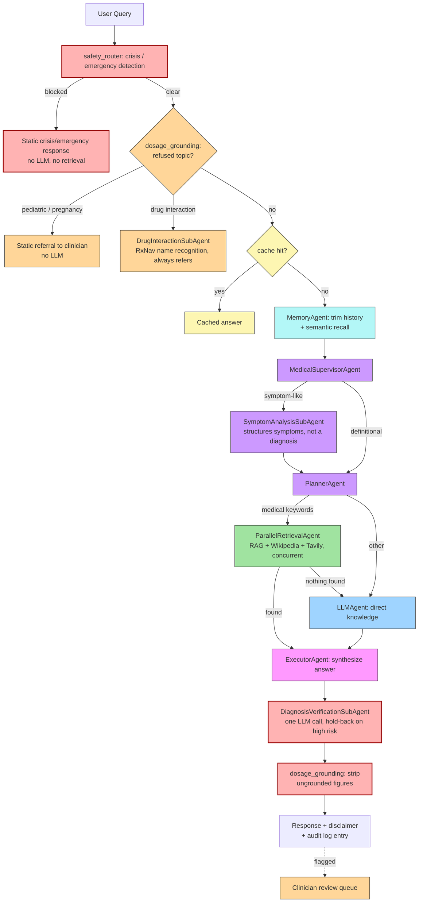

# **MediGenius: AI-Powered Multi-Agent Medical Assistant**

<p align="center">
  <a href="https://www.python.org/"></a>
  <a href="https://fastapi.tiangolo.com/"></a>
  <a href="https://langchain.com/"></a>
  <a href="https://langchain-ai.github.io/langgraph/"></a>
  <a href="https://groq.com/"></a>
</p>

<p align="center">
  <a href="https://huggingface.co/"></a>
  <a href="https://www.trychroma.com/"></a>
  <a href="https://www.litellm.ai/"></a>
  <a href="https://scikit-learn.org/"></a>
  <a href="https://pandas.pydata.org/"></a>
  <a href="https://numpy.org/"></a>
</p>

<p align="center">
  <a href="https://react.dev/"></a>
  <a href="https://tailwindcss.com/"></a>
  <a href="https://www.docker.com/"></a>
</p>

**MediGenius** helps people understand symptoms, medications, and health questions in plain language — and just as
importantly, it knows when *not* to answer, steering users to a real doctor, pharmacist, or crisis helpline instead
of guessing. It's built for the reality that a wrong medical answer is worse than no answer, so safety checks run
on every single response, not just the risky-looking ones.

Under the hood, **MediGenius** is a multi-agent medical information assistant orchestrated as a **LangGraph
`StateGraph`** on top of **Groq**-hosted LLMs, routed through a **LiteLLM model gateway** for tiered retry/fallback.
Every answer passes
through a deterministic pre-pipeline safety gate (`safety_router`) before any model is called, and a
post-generation verification agent (`DiagnosisVerificationSubAgent`) before it reaches the user — the safety
layer is not a bolt-on, it's the first and last thing that runs on every request.

The system combines **medical RAG** (`ParallelRetrievalAgent`, over a verified PDF indexed in **ChromaDB** with
HuggingFace sentence-transformer embeddings), **concurrent live-web retrieval** (Wikipedia + Tavily), and
**direct LLM knowledge** (`LLMAgent`) as fallbacks of each other, synthesized by an `ExecutorAgent`. A
`MedicalSupervisorAgent` conditionally routes symptom-describing questions to a `SymptomAnalysisSubAgent` for
structuring, and drug-related questions to a `DrugInteractionSubAgent` for RxNav (NIH) name recognition +
pharmacist referral (never LLM recall). A `MemoryAgent` persists chat history in SQLite and adds session-scoped
semantic recall over a separate ChromaDB collection.

---

[](https://github.com/user-attachments/assets/d491cf14-a7b0-4fce-804e-b174da779f7a)


---

## **Live Demo**

You can interact with the live AI-powered medical assistant here: [https://medigenius.onrender.com/](https://medigenius.onrender.com/)

---

## **Safety Architecture**

This is the part of the system worth reading closely before anything else, and it runs **before and after** the
agent graph, not inside it — none of it is LLM-judged where a deterministic rule can do the job instead.

| Stage | What it does | LLM involved? |
| --- | --- | --- |
| **Safety router** (`core/safety_router.py`) | Pattern-matches crisis/emergency language, returns a fixed helpline response. | No |
| **Refused topics** (`core/dosage_grounding.py`) | Hard-refuses paediatric/pregnancy dosing and drug-interaction questions, refers to a pharmacist. | No |
| **Dosage grounding** (`core/dosage_grounding.py`) | Strips any dosage figure not found in the retrieved sources. | No |
| **Diagnosis verification** (`agents/diagnosis_verification_sub_agent.py`) | Checks a grounded answer against its evidence; holds back high-risk claims. | Yes, one call |
| **Disclaimer** | Every answer carries a `disclaimer` field. | No |
| **Review queue** (`api/v1/endpoints/review.py`) | Flags risky/refused/fallback answers for clinician review. | No |

---

## **Real-World Use Cases**

Reworded from the previous version of this README, which described the system as giving "preliminary medical
advice" — that oversold what a pattern-gated LLM pipeline can responsibly do. What it actually does:

1. **Health Information & Triage** — Understand a symptom or condition well enough to know how urgently to see a clinician.
2. **Mental Health First Aid Referral** — Recognizes crisis language and connects to a real helpline, never counsels.
3. **Patient Pre-visit Preparation** — Structures a symptom description for a clinician — not a diagnosis.
4. **Medication Information (not dosing)** — General usage info only; dosing and interactions are hard-refused and referred to a pharmacist.
5. **Educational Assistant** — Explains medical topics in plainer language, sourced from a curated reference text.

---

## **Measured Performance**

What follows instead are single-run latency measurements taken during this session's testing, against the live
Groq API, on the deployed pipeline shape described below. This is **not** a statistical benchmark — no percentiles,
no repeated trials — just an honest snapshot of what each path currently costs:

| Path | Measured latency | Why |
| --- | --- | --- |
| Crisis / emergency (blocked) | **~0.01–0.02s** | Returns before the graph runs at all — no LLM, no retrieval |
| Refused topic (paediatric/pregnancy dosing) | **~0.01s** | Same — static referral, no LLM, no retrieval |
| Refused topic (drug interaction) | **~5s** | Sequential RxNav (NIH) HTTP lookups for name recognition, no LLM |
| Cache hit (repeated exact question) | **~0.01–0.02s** | Served from the in-memory TTL cache, whole graph skipped |
| Casual/definitional chat (direct LLM) | **~0.7–0.8s** | One Groq call, no retrieval |
| Medical question with RAG hit | **~7–11s** | Parallel retrieval fan-out + synthesis + one verification call (occasionally two, if a revision fires) |

---

## **Features**

* **Deterministic safety layer** — crisis/emergency detection, refused-topic hard-stops, dosage grounding, and an unskippable disclaimer, never LLM-decided
* **Diagnosis verification** — one structured LLM call catches unsupported clinical claims, with a capped revision pass and a hold-back for high risk
* **Medical supervisor + sub-agents** — deterministic routing to a symptom-structuring agent and a drug-name-recognition agent
* **Parallel retrieval** — RAG, Wikipedia, and Tavily fanned out concurrently with per-branch timeouts
* **LiteLLM model gateway** — tiered Groq models with retry on errors and tier-drop fallback on rate limits
* **Exact-match caching** — in-memory TTL cache for repeated questions and retrieval results, no semantic cache
* **Rate limiting** — proxy-aware, protects Groq/Tavily quota and the DuckDuckGo IP-block threshold
* **Audit log + clinician review queue** — metadata-only request logging with a paginated review queue and agreement rate
* **Session memory** — SQLite chat history plus session-scoped semantic recall over a separate Chroma collection
* **RAG (Retrieval-Augmented Generation)** from an indexed medical PDF via PyPDFLoader + HuggingFace Embeddings + ChromaDB
* **FastAPI backend** with **React, Tailwind CSS 4, DaisyUI 5** frontend
* **Dockerized deployment**, **CI/CD pipeline** for automated testing and deployment

---

## **Technical Stack**

| **Category**                  | **Technology/Resource** |
|-------------------------------|--------------------------|
| **Core Framework**            | LangChain, LangGraph |
| **Multi-Agent Orchestration** | MedicalSupervisorAgent, SymptomAnalysisSubAgent, DrugInteractionSubAgent, PlannerAgent, ParallelRetrievalAgent, LLMAgent, ExecutorAgent, DiagnosisVerificationSubAgent, MemoryAgent |
| **LLM Provider**              | Groq — `openai/gpt-oss-120b` (synthesis/reasoning), `openai/gpt-oss-20b` (classification/fallback), routed via LiteLLM |
| **Embeddings Model**          | HuggingFace (sentence-transformers/all-MiniLM-L6-v2), shared between the medical-PDF vector store and conversation memory |
| **Vector Database**           | ChromaDB (cosine similarity), two collections: medical literature and conversation memory |
| **Document Processing**       | PyPDFLoader (PDF), RecursiveCharacterTextSplitter |
| **Search Tools**              | Wikipedia API, Tavily web search (both fanned out concurrently); DuckDuckGo tool present but not wired into the active pipeline |
| **External API**              | RxNav / RxNorm (NIH) — drug name normalization only; NIH discontinued the actual interaction-checking API in 2024 |
| **Caching**                   | `cachetools` (in-memory TTL, exact-match only) |
| **Rate Limiting**             | `slowapi` |
| **Conversation Flow**         | LangGraph `StateGraph` — pre-pipeline safety gate, conditional sub-agent routing, parallel retrieval fan-out |
| **Medical Knowledge Base**    | Domain-specific medical PDF + Wikipedia + live web search |
| **Backend**                   | FastAPI (REST API + application logic) |
| **Frontend**                  | React 19, Vite 7, Tailwind CSS 4, DaisyUI 5 |
| **Deployment**                | Docker (containerized), local development, production-ready build |
| **CI/CD**                     | GitHub Actions (automated testing & deployment) |
| **Environment Management**    | python-dotenv (environment variables) |
| **Logging & Monitoring**      | Console + rotating file logging; metadata-only audit trail in SQLite |

---

## **Project File Structure**

```text
MediGenius/
├── .github/
│   └── workflows/
│       └── ci-cd.yml             # GitHub Actions CI/CD Pipeline
├── backend/
│   ├── app/
│   │   ├── agents/               # LangGraph agent + sub-agent logic
│   │   │   ├── __init__.py
│   │   │   ├── diagnosis_verification_sub_agent.py   # Phase 5 — post-generation claim verification
│   │   │   ├── drug_interaction_sub_agent.py         # Phase 6 — RxNav name recognition, always refers
│   │   │   ├── executor.py
│   │   │   ├── explanation.py
│   │   │   ├── llm_agent.py
│   │   │   ├── medical_supervisor_agent.py           # Phase 6 — routes to symptom analysis or not
│   │   │   ├── memory.py                             # trims history + semantic recall
│   │   │   ├── parallel_retrieval_agent.py           # Phase 6 — RAG/Wikipedia/Tavily fan-out
│   │   │   ├── planner.py
│   │   │   ├── retriever.py                          # kept, no longer wired into the graph
│   │   │   ├── symptom_analysis_sub_agent.py          # Phase 6 — structures symptoms, never diagnoses
│   │   │   ├── tavily.py                             # kept, no longer wired into the graph
│   │   │   └── wikipedia.py                          # kept, no longer wired into the graph
│   │   ├── api/                  # API Layer
│   │   │   ├── v1/               # Versioned API (v1)
│   │   │   │   ├── endpoints/    # Modular endpoint logic
│   │   │   │   │   ├── __init__.py
│   │   │   │   │   ├── chat.py
│   │   │   │   │   ├── health.py
│   │   │   │   │   ├── review.py                     # Phase 8 — clinician review queue + stats
│   │   │   │   │   └── session.py
│   │   │   │   ├── api.py        # Router aggregator
│   │   │   │   └── __init__.py
│   │   │   └── __init__.py
│   │   ├── core/                 # Core configuration and cross-cutting policy
│   │   │   ├── __init__.py
│   │   │   ├── cache.py                              # Phase 3 — exact-match TTL cache
│   │   │   ├── config.py
│   │   │   ├── dosage_grounding.py                   # Phase 2 — number grounding + refused topics
│   │   │   ├── langgraph_workflow.py
│   │   │   ├── logging_config.py
│   │   │   ├── rate_limit.py                         # Phase 3 — slowapi limiter
│   │   │   ├── safety_router.py                      # Phase 1 — crisis/emergency gate, deterministic
│   │   │   └── state.py
│   │   ├── db/                   # Database Session Management
│   │   │   ├── __init__.py
│   │   │   └── session.py
│   │   ├── models/               # SQLAlchemy Models
│   │   │   ├── __init__.py
│   │   │   ├── audit_log.py                          # Phase 3/8 — metadata-only audit trail + review fields
│   │   │   └── message.py
│   │   ├── schemas/              # Pydantic Schemas
│   │   │   ├── __init__.py
│   │   │   ├── chat.py
│   │   │   ├── review.py                             # Phase 8
│   │   │   └── session.py
│   │   ├── services/             # Business Logic Services
│   │   │   ├── __init__.py
│   │   │   ├── chat_service.py
│   │   │   └── database_service.py
│   │   ├── storage/               # Persistent Data
│   │   │   ├── chat_db/           # SQLite Database
│   │   │   └── vector_store/      # ChromaDB — medical literature + conversation memory collections
│   │   ├── tools/                 # Agentic Tools (RAG, Search, Model Gateway)
│   │   │   ├── __init__.py
│   │   │   ├── duckduckgo_search.py                  # placeholder, not wired into the graph
│   │   │   ├── llm_client.py                         # kept, superseded by model_gateway.py
│   │   │   ├── memory_store.py                       # Phase 7 — session-scoped semantic recall
│   │   │   ├── model_gateway.py                      # Phase 4 — LiteLLM routing/fallback
│   │   │   ├── pdf_loader.py
│   │   │   ├── tavily_search.py
│   │   │   ├── vector_store.py
│   │   │   └── wikipedia_search.py
│   │   ├── main.py               # Application Entry Point
│   │   └── __init__.py
│   ├── data/                     # Data Sources
│   │   └── medical_book.pdf      # Source PDF
│   ├── logs/                     # Rotation Logs
│   ├── tests/                    # Backend Test Suite (100% statement/branch coverage — see Testing and QA)
│   │   ├── test_database/        # Isolated Test DB
│   │   ├── conftest.py           # Pytest Fixtures
│   │   ├── pytest.ini            # Pytest Config
│   │   ├── test_agents.py
│   │   ├── test_api.py
│   │   ├── test_api_edge_cases.py
│   │   ├── test_audit_log.py
│   │   ├── test_cache.py
│   │   ├── test_coverage_gaps.py
│   │   ├── test_database.py
│   │   ├── test_diagnosis_verification.py
│   │   ├── test_dosage_grounding.py
│   │   ├── test_logging.py
│   │   ├── test_memory_store.py
│   │   ├── test_model_gateway.py
│   │   ├── test_parallel_retrieval.py
│   │   ├── test_rate_limit.py
│   │   ├── test_review_api.py
│   │   ├── test_review_queue.py
│   │   ├── test_safety_router.py
│   │   ├── test_services.py
│   │   ├── test_supervisor_and_sub_agents.py
│   │   ├── test_tools.py
│   │   ├── test_workflow.py
│   │   └── test_workflow_routing.py
│   ├── Dockerfile                # Multi-stage Backend Build
│   ├── pyproject.toml            # Tooling Config (isort, etc.)
│   └── requirements.txt          # Python Dependencies
├── frontend/
│   ├── public/                   # Static sensitive assets
│   ├── src/
│   │   ├── App.jsx               # Main UI Orchestrator (Single-file component architecture)
│   │   ├── App.test.jsx          # Vitest Integration tests
│   │   ├── index.css             # Tailwind 4 Custom Styles
│   │   ├── index.jsx             # React Entry Point
│   │   └── setupTests.js         # Vitest Config
│   ├── Dockerfile                # Production Nginx Build
│   ├── nginx.conf                # Proxy & Routing Config
│   ├── package.json              # Node Dependencies
│   ├── postcss.config.js         # Tailwind v4 Compatibility
│   ├── tailwind.config.js        # Theme Presets
│   └── vite.config.js            # Build & Proxy Config
├── notebook/                     # Research & Development
│   ├── Fine Tuning LLM.ipynb
│   ├── Model Train.ipynb
│   └── experiment.ipynb
├── demo-1.png                    # Demo Screenshot 1
├── demo-2.png                    # Demo Screenshot 2
├── demo.mp4                      # Demo Video
├── docker-compose.yml            # Unified Stack Orchestration
├── run.py                        # Unified Local Dev Script
├── render.yml                    # Cloud Deployment Manifest
└── LICENSE                       # MIT License
```

---

## **Project Architecture**



Red = deterministic or verification safety stages. Orange = refusal / review paths. Everything else is the normal
answer-generation flow.

---

## **Getting Started**

### **1. Prerequisites**
- **Python**: 3.10 or higher
- **Node.js**: 18+ (for frontend)
- **API Keys**:
  - `GROQ_API_KEY` (Get from [Groq Console](https://console.groq.com/))
  - `TAVILY_API_KEY` (Get from [Tavily AI](https://tavily.com/))

### **2. Environment Setup**
Create a `.env` file in the `backend/` directory (all values below are optional except the two API keys — every
one has a working default):
```env
# Required
GROQ_API_KEY=your_key_here
TAVILY_API_KEY=your_key_here

# Paths (defaults are relative to backend/)
CHAT_DB_PATH=./storage/chat_db/medigenius.db
VECTOR_STORE_DIR=./storage/vector_store
LOG_DIR=./logs
PDF_PATH=./data/medical_book.pdf

# Rate limiting (Phase 3)
RATE_LIMIT_ENABLED=1
RATE_LIMIT=20/minute

# Memory (Phase 7)
MAX_RECALLED_MEMORIES=3

# Model gateway (Phase 4) — Groq only, verify current IDs at console.groq.com/docs/models
SYNTHESIS_MODEL=groq/openai/gpt-oss-120b
REASONING_MODEL=groq/openai/gpt-oss-120b
CLASSIFICATION_MODEL=groq/openai/gpt-oss-20b
```

---

## **Running the Project**

### **Option 1: Unified Local Run (Recommended for Dev)**
We provide a helper script to launch both backend and frontend simultaneously:
```bash
python run.py
```
- **Backend API**: `http://localhost:8000` (Docs: `/docs`)
- **Frontend UI**: `http://localhost:5173`

### **Option 2: Manual Run**
**Backend:**
```bash
cd backend
python -m uvicorn app.main:app --reload
```

**Frontend:**
```bash
cd frontend
npm install
npm run dev
```

### **Option 3: Docker Orchestration (Recommended for Prod)**
Use Docker for a production-grade containerized environment:
```bash
# Build and start all services
docker-compose up --build
```

---

## **API Endpoints**

All routes are prefixed `/api/v1`. **None of these endpoints require authentication** — see [Limitations](#limitations).

| Method & Path | Purpose | Rate limit | Notes |
| --- | --- | --- | --- |
| `GET /health` | Liveness check | — | |
| `POST /chat` | Send a message through the full pipeline | 20/min (configurable) | Response includes `disclaimer`, `safety`, `verification`, `symptom_summary` fields on top of the original `response`/`source`/`timestamp`/`success` |
| `POST /clear` | Reset the in-memory conversation state for the current session | — | Does not delete persisted history |
| `POST /new-chat` | Start a fresh session ID | — | |
| `GET /history` | Chat history for the current session | — | |
| `GET /sessions` | All sessions with previews | — | |
| `GET /session/{id}` | Load a specific session | — | |
| `DELETE /session/{id}` | Delete a session's chat history **and** its semantic-memory entries | — | Full delete, not partial |
| `GET /review` | Paginated queue of answers flagged for clinician review (`page`, `page_size`, `status` query params) | — | |
| `POST /review/{id}` | Record a clinician's verdict against a flagged item | 20/min (configurable) | Never overwrites the original flagged record |
| `GET /stats` | Aggregate counts: total messages, review backlog, model-vs-human agreement rate | — | |

**Cache behavior:** exact-match only, normalized question text as the key. Answer cache: 500 entries, 1-hour TTL.
Retrieval cache (RAG/Wikipedia results): 200 entries, 6-hour TTL. Questions matching a refused topic (paediatric,
pregnancy/breastfeeding, drug interaction) are never cached under any circumstances.

---

## **Testing and QA**

### **Backend Coverage**

```bash
cd backend
# Run all tests
python -m pytest tests/

# Check coverage report
python -m pytest --cov=app --cov-branch tests/ --cov-report=term-missing
```

### **Frontend Testing**
The frontend uses `vitest` for component testing.
```bash
cd frontend
# Run frontend tests
npm run test
```

### **Code Quality**
We strictly enforce code standards:
- **Linting**: `flake8 app/ tests/`
- **Import Sorting**: `isort app/ tests/` (Automatically organized)
- **Zero-Log Policy**: Tests are configured to suppress `.log` file creation to keep the workspace clean.

---

## **CI/CD & DevOps**

### **GitHub Actions**
The project includes a pre-configured CI/CD pipeline (`.github/workflows/ci-cd.yml`) that triggers on every push or pull request to the **`master`** branch.
- **Backend Tests**: Runs `pytest` with coverage.
- **Frontend Tests**: Runs `vitest`.
- **Code Quality**: Verifies `flake8` and `isort` compliance.
- **Docker Build**: Validates the Docker image build process for both components.

---

## **Limitations**

- **Crisis/emergency detection is pattern-based and will have false negatives.**
- **The system does not diagnose.**
- **Drug interaction coverage is name-recognition only.**
- **Verification thresholds are unvalidated heuristics.**
- **Latency figures above are single-run measurements from one test session**

---

## **Developed By**

**Md Emon Hasan**  
**Email:** emon.mlengineer@gmail.com  
**Portfolio:** [Md-Emon-Hasan](https://emonlabs-ai.hitechparks.com)  
**WhatsApp:** [+8801834363533](https://wa.me/8801834363533)  
**GitHub:** [Md-Emon-Hasan](https://github.com/Md-Emon-Hasan)  
**LinkedIn:** [Md Emon Hasan](https://www.linkedin.com/in/md-emon-hasan-695483237/)  
**Facebook:** [Md Emon Hasan](https://www.facebook.com/mdemon.hasan2001/)
---

## License
MIT License. Free to use with credit.
