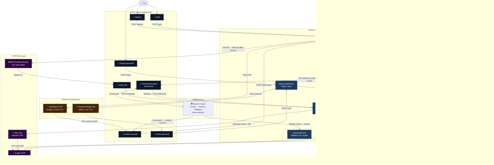
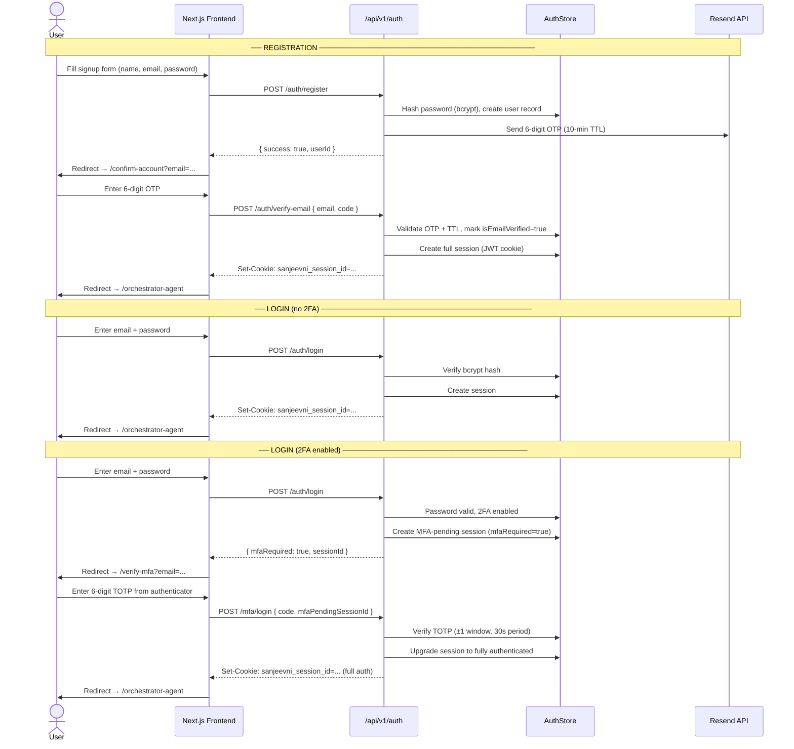
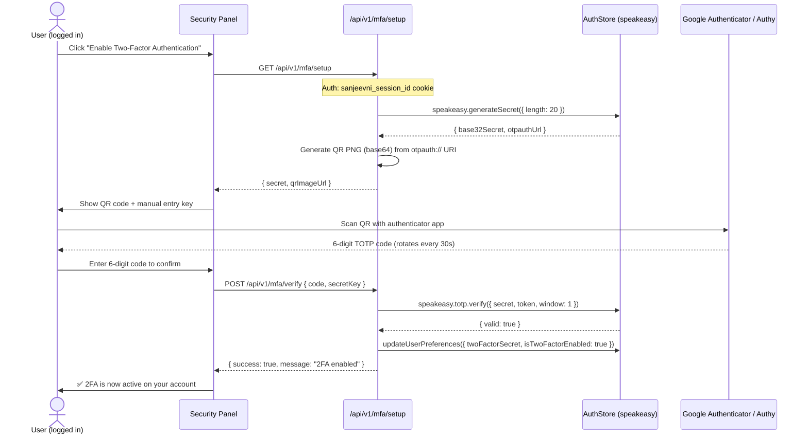

# 🔐 Two-Factor Authentication (2FA) — Sanjeevni OS

> **Audience:** Developers, security reviewers, and platform contributors  
> **System:** Sanjeevni OS (Synapse-OS) · Next.js 16 App Router  
> **Auth Layer:** Custom JWT-based auth store (`frontend/src/lib/auth-store.ts`)

---

## 📑 Table of Contents

| # | Section |
|---|---------|
| 1 | [Overview](#1-overview) |
| 2 | [Architecture Diagram](#2-architecture-diagram) |
| 3 | [Authentication Flow — Full Lifecycle](#3-authentication-flow--full-lifecycle) |
| 4 | [2FA Setup Flow](#4-2fa-setup-flow) |
| 5 | [2FA Login Flow](#5-2fa-login-flow) |
| 6 | [API Reference](#6-api-reference) |
| 7 | [Email Verification (Resend)](#7-email-verification--resend-integration) |
| 8 | [Data Model](#8-data-model) |
| 9 | [Security Properties](#9-security-properties) |
| 10 | [Pages & Components](#10-pages--components) |
| 11 | [Environment Variables](#11-environment-variables) |
| 12 | [Testing 2FA Locally](#12-testing-2fa-locally) |

---

## 1. Overview

Sanjeevni OS implements a **full production-grade multi-factor authentication system** entirely within the Next.js App Router — no third-party auth provider required. The system supports:

| Capability | Implementation |
|---|---|
| **Email + Password registration** | bcrypt hashed, persisted to `auth-store.json` |
| **Email verification** (OTP) | 6-digit code delivered via **Resend** transactional email |
| **JWT session cookies** | `sanjeevni_session_id` httpOnly cookie |
| **TOTP-based 2FA** | RFC 6238 compliant, compatible with Google Authenticator / Authy |
| **QR code enrollment** | `otpauth://` URI rendered as base64 PNG |
| **MFA-protected login** | Second factor challenge issued on login when 2FA is enabled |
| **Session management** | Multi-session support, IP + User-Agent binding |
| **Password reset** | Email link → token-gated reset page |
| **Forgot password** | Resend-powered reset email |

---

## 2. Architecture Diagram



---

## 3. Authentication Flow — Full Lifecycle



---

## 4. 2FA Setup Flow

The user enables 2FA from the **Security & Sessions** tab in the Orchestrator dashboard.



---

## 5. 2FA Login Flow

```mermaid
flowchart TD
    A([User submits email + password]) --> B{Password valid?}
    B -->|No| ERR1[401 Invalid credentials]
    B -->|Yes| C{Email verified?}
    C -->|No| ERR2[Redirect /confirm-account]
    C -->|Yes| D{isTwoFactorEnabled?}
    D -->|No| E[Create full session\nSet sanjeevni_session_id cookie]
    E --> DASH([Redirect /orchestrator-agent])
    D -->|Yes| F[Create MFA-pending session\nmfaRequired: true\nmfaPendingToken issued]
    F --> G([Redirect /verify-mfa?email=...])
    G --> H[User opens authenticator app\nEnters 6-digit TOTP]
    H --> I{POST /mfa/login\nVerify TOTP token}
    I -->|Invalid / expired| ERR3[400 Invalid code]
    I -->|Valid| J[Upgrade session:\nmfaRequired → false\nfull auth granted]
    J --> K[Set sanjeevni_session_id cookie\n(httpOnly, SameSite=Lax)]
    K --> DASH2([Redirect /orchestrator-agent])
```

---

## 6. API Reference

All routes are under `/api/v1/` and served by Next.js Route Handlers.

### Auth Routes — `/api/v1/auth/[action]`

| Method | Action | Description | Auth Required |
|--------|--------|-------------|---------------|
| `POST` | `register` | Create new user account | No |
| `POST` | `login` | Authenticate with email + password | No |
| `POST` | `verify-email` | Verify OTP from registration email | No |
| `POST` | `resend-verification` | Resend OTP to email | No |
| `POST` | `logout` | Invalidate current session | Yes (cookie) |

#### `POST /api/v1/auth/register`
```json
// Request
{ "name": "string", "email": "string", "password": "string" }

// Response 200
{ "success": true, "message": "Verification email sent", "userId": "uuid" }
```

#### `POST /api/v1/auth/login`
```json
// Request
{ "email": "string", "password": "string" }

// Response (2FA off) — sets sanjeevni_session_id cookie
{ "success": true, "user": { "id": "...", "name": "...", "email": "...", "isEmailVerified": true } }

// Response (2FA on)
{ "mfaRequired": true, "message": "MFA verification required", "sessionId": "mfa-pending-..." }
```

#### `POST /api/v1/auth/verify-email`
```json
// Request
{ "email": "string", "code": "123456" }

// Response — sets sanjeevni_session_id cookie
{ "success": true, "user": { ... } }
```

---

### MFA Routes — `/api/v1/mfa/[action]`

| Method | Action | Description | Auth Required |
|--------|--------|-------------|---------------|
| `GET` | `setup` | Generate TOTP secret + QR code | Yes (cookie) |
| `POST` | `verify` | Confirm TOTP code to activate 2FA | Yes (cookie) |
| `POST` | `login` | Complete MFA challenge during login | MFA-pending session |
| `POST` | `disable` | Disable 2FA on account | Yes (cookie) |

#### `GET /api/v1/mfa/setup`
```json
// Response
{
  "message": "Scan the QR code or enter the setup key into your authenticator app.",
  "secret": "JBSWY3DPEHPK3PXP",
  "qrImageUrl": "data:image/png;base64,..."
}
```

#### `POST /api/v1/mfa/verify`
```json
// Request
{ "code": "123456", "secretKey": "JBSWY3DPEHPK3PXP" }

// Response
{ "success": true, "message": "Two-factor authentication has been enabled." }
```

#### `POST /api/v1/mfa/login`
```json
// Request
{ "code": "123456", "mfaPendingSessionId": "mfa-pending-uuid" }

// Response — sets full sanjeevni_session_id cookie
{ "success": true, "user": { ... } }
```

#### `POST /api/v1/mfa/disable`
```json
// Request
{ "code": "123456" }   // TOTP confirmation required to disable

// Response
{ "success": true, "message": "Two-factor authentication has been disabled." }
```

---

### Session Routes — `/api/v1/session/[action]`

| Method | Action | Description | Auth Required |
|--------|--------|-------------|---------------|
| `GET` | `validate` | Validate current session | Yes |
| `GET` | `list` | List all active sessions | Yes |
| `POST` | `revoke` | Revoke a specific session by ID | Yes |

---

### Password Routes — `/api/v1/password/[action]`

| Method | Action | Description | Auth Required |
|--------|--------|-------------|---------------|
| `POST` | `forgot` | Send password reset email | No |
| `POST` | `reset` | Reset password with token | No |

#### `POST /api/v1/password/forgot`
```json
// Request
{ "email": "user@example.com" }
// Response
{ "success": true, "message": "Password reset email sent." }
```

#### `POST /api/v1/password/reset`
```json
// Request
{ "token": "reset-token-from-email", "password": "new-password" }
// Response
{ "success": true, "message": "Password reset successfully." }
```

---

## 7. Email Verification — Resend Integration

Sanjeevni OS uses **[Resend](https://resend.com)** for transactional emails.

### Email Types

| Email | Trigger | TTL | Template |
|-------|---------|-----|----------|
| **Account Verification OTP** | `POST /auth/register` | 10 minutes | 6-digit code, HTML |
| **Resend Verification OTP** | `POST /auth/resend-verification` | 10 minutes | 6-digit code, HTML |
| **Password Reset Link** | `POST /password/forgot` | 1 hour | Token URL, HTML |

### Rate Limits

| Plan | Daily Quota | Rate Limit |
|------|------------|------------|
| Free (onboarding@resend.dev) | 1 email/day | 10/second |
| Free (custom domain) | 100/day | 10/second |
| Pro | 50,000/day | — |

> ⚠️ **Important**: The free Resend plan with `onboarding@resend.dev` sender can only deliver to the **account owner's verified email**. To send to any address, add a verified domain at [resend.com/domains](https://resend.com/domains).

### Mailer Configuration

| Variable | Description |
|---|---|
| `RESEND_API_KEY` | Resend API key (`re_xxx...`) |
| `RESEND_FROM_EMAIL` | Sender address (e.g. `noreply@sanjeevni.ai`) |

---

## 8. Data Model

### UserRecord (in `auth-store.ts`)

```typescript
interface UserRecord {
  id: string;                        // UUID v4
  name: string;
  email: string;
  passwordHash: string;             // bcrypt ($2b$, 12 rounds)
  isEmailVerified: boolean;
  emailVerificationCode?: string;   // 6-digit OTP
  emailVerificationExpiry?: number; // Unix timestamp (ms)
  passwordResetToken?: string;      // UUID token
  passwordResetExpiry?: number;     // Unix timestamp (ms)
  userPreferences: {
    isTwoFactorEnabled: boolean;
    twoFactorSecret?: string;       // Base32 TOTP secret
    language: string;
    notifications: boolean;
  };
  createdAt: number;
  lastLoginAt?: number;
}
```

### SessionRecord

```typescript
interface SessionRecord {
  id: string;                  // UUID v4 → sanjeevni_session_id cookie value
  userId: string;
  createdAt: number;
  expiresAt: number;          // 7-day TTL
  ipAddress?: string;
  userAgent?: string;
  mfaRequired?: boolean;      // true = MFA-pending, user not yet fully authenticated
}
```

### Persistence

All data is stored in memory (`Map<>`) and **synced to disk** after every mutation:

```
frontend/.data/auth-store.json
```

> ⚠️ **Dev only**: This JSON file is for local development. In production, replace with PostgreSQL + Redis sessions.

---

## 9. Security Properties

| Property | Details |
|---|---|
| **Password hashing** | `bcryptjs` with 12 salt rounds |
| **TOTP algorithm** | SHA-1 (RFC 6238), 6 digits, 30-second period |
| **TOTP window** | ±1 step (allows ±30s clock drift) |
| **Session cookie** | `httpOnly`, `SameSite=Lax`, `Path=/`, 7-day TTL |
| **OTP TTL** | 10 minutes for email verification codes |
| **Reset token TTL** | 1 hour for password reset links |
| **MFA pending session** | Cannot access protected routes — middleware guards |
| **Middleware allowlist** | `/confirm-account`, `/forgot-password`, `/reset-password`, `/verify-mfa` always pass through |
| **No client-side secrets** | TOTP secret never exposed to browser after setup |

### Middleware Route Guard

```
/orchestrator-agent/*  → requires valid session + isEmailVerified
/login, /signup        → blocked if already authenticated + isEmailVerified
/confirm-account       → always accessible (verification flow)
/forgot-password       → always accessible
/reset-password        → always accessible  
/verify-mfa            → always accessible (MFA challenge)
```

---

## 10. Pages & Components

| Path | Purpose |
|---|---|
| `frontend/src/app/signup/page.tsx` | Registration form |
| `frontend/src/app/login/page.tsx` | Login form + MFA detection |
| `frontend/src/app/confirm-account/page.tsx` | Email OTP verification |
| `frontend/src/app/verify-mfa/page.tsx` | TOTP challenge during login |
| `frontend/src/app/forgot-password/page.tsx` | Request password reset email |
| `frontend/src/app/reset-password/page.tsx` | Reset password with token |
| `frontend/src/components/orchestrator/SecuritySessionsPanel.tsx` | 2FA setup UI + session management |
| `frontend/src/context/AuthContext.tsx` | `register()`, `login()`, `verifyEmail()`, `verifyMFALogin()`, `logout()` |
| `frontend/src/lib/auth-store.ts` | All persistence, TOTP, bcrypt logic |
| `frontend/src/lib/resend-mailer.ts` | Resend email templates |
| `frontend/src/middleware.ts` | Route protection middleware |

---

## 11. Environment Variables

Add these to `frontend/.env.local`:

```env
# Resend (Email verification & password reset)
RESEND_API_KEY=re_xxxxxxxxxxxxxxxxxxxx
RESEND_FROM_EMAIL=noreply@yourdomain.com

# App URL (for reset links)
NEXT_PUBLIC_APP_URL=http://localhost:3000
```

---

## 12. Testing 2FA Locally

### Step 1 — Clear the store (fresh start)
```powershell
Remove-Item frontend/.data/auth-store.json -Force -ErrorAction SilentlyContinue
```

### Step 2 — Register
```
http://localhost:3000/signup
```
Fill in name, email, password → submit. Check email for 6-digit OTP.

### Step 3 — Verify email
Enter OTP on `/confirm-account`. You'll be redirected to the orchestrator.

### Step 4 — Enable 2FA
Go to **Orchestrator → Security & Sessions tab** → click **Enable 2FA**. Scan QR with Google Authenticator or Authy.

### Step 5 — Test 2FA login
Log out → log back in → you'll be redirected to `/verify-mfa`. Enter the 6-digit code from your authenticator app.

### Step 6 — Test password reset
Go to `/forgot-password` → enter email → check inbox for reset link.

---

## Appendix — TOTP Technical Details

| Parameter | Value |
|---|---|
| Algorithm | HMAC-SHA1 |
| Digit count | 6 |
| Time step | 30 seconds |
| Clock drift tolerance | ±1 step (±30s) |
| Secret encoding | Base32 |
| QR format | `otpauth://totp/Sanjeevni OS:<email>?secret=<base32>&issuer=Sanjeevni OS` |
| Library | `speakeasy` (Node.js) |
| Compatible apps | Google Authenticator, Authy, 1Password, Microsoft Authenticator |

---

*Part of [Sanjeevni OS](../README.md) — Autonomous AI Health for Every Indian*
