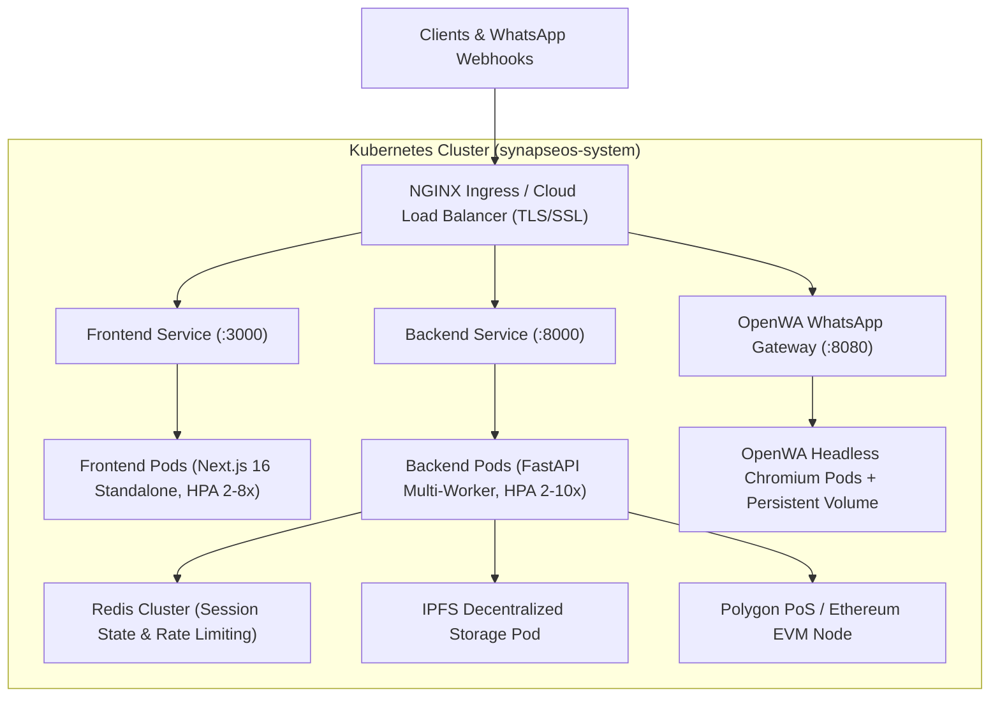

# 🐳 SynapseOS: Production Containerization & Cloud Orchestration Architecture

[](https://docker.com)
[](https://kubernetes.io)

This document provides a comprehensive technical blueprint for containerizing, orchestrating, and scaling the **SynapseOS / Sanjeevni AI Health Operating System** across Docker, Docker Compose, Kubernetes (K8s), and cloud-native infrastructure.

---

## 📌 Architecture Overview



---

## 📦 Container Services Matrix

| Service | Technology | Base Image | Port | Function & Role |
| :--- | :--- | :--- | :---: | :--- |
| **`frontend`** | Next.js 16, React 19, TS | `node:20-alpine` | `3000` | Multi-stage standalone UI build. Delivers clinical dashboards, assistant workspaces, and WebRTC voice interfaces with sub-second TTFB. |
| **`backend`** | FastAPI, PyTorch, Uvicorn | `python:3.11-slim` | `8000` | Multi-agent DAG swarm, MONAI & YOLOv8 diagnostic inference, ICMR nutrition algorithms, FHIR R4 bundling, and ABDM scheme matching. |
| **`openwa`** | Node.js, Chromium, Puppeteer | `node:20-bullseye-slim` | `8080` | Headless WhatsApp Web session daemon for automated patient intake, lab PDF dispatch, and medication reminders. |
| **`redis`** | Redis 7 In-Memory DB | `redis:7-alpine` | `6379` | High-throughput distributed cache, rate limiting, and real-time state synchronization across agent swarms. |
| **`ipfs`** | IPFS Kubo | `ipfs/kubo:latest` | `5001 / 8081` | Content-addressable storage for encrypted medical records, X-ray scans, and verifiable ABDM audit trails. |

---

## 🚀 Local Deployment with Docker Compose

### 1. Build and Launch All Services
```bash
# Build images and start all containers in detached mode
docker compose up -d --build

# View real-time aggregated logs
docker compose logs -f
```

### 2. Service Access Points
- **Frontend Web Workspace**: [`http://localhost:3000`](http://localhost:3000)
- **Backend API & Swagger Docs**: [`http://localhost:8000/docs`](http://localhost:8000/docs)
- **OpenWA WhatsApp Bridge**: [`http://localhost:8080`](http://localhost:8080)
- **IPFS Gateway**: [`http://localhost:8081`](http://localhost:8081)

### 3. Graceful Teardown
```bash
docker compose down -v
```

---

## ☸️ Kubernetes (K8s) Production Deployment

All Kubernetes manifests are located under the [`k8s/`](../k8s/) directory.

### 1. Apply Manifests in Sequence
```bash
# 1. Create dedicated namespace
kubectl apply -f k8s/namespace.yaml

# 2. Apply ConfigMaps and Secrets
kubectl apply -f k8s/configmap.yaml
kubectl apply -f k8s/secrets.yaml

# 3. Deploy Workloads and Services
kubectl apply -f k8s/backend-deployment.yaml
kubectl apply -f k8s/frontend-deployment.yaml
kubectl apply -f k8s/openwa-deployment.yaml

# 4. Apply Ingress & Horizontal Pod Autoscalers
kubectl apply -f k8s/ingress.yaml
kubectl apply -f k8s/hpa.yaml
```

### 2. Verify Pod Status & Autoscaling
```bash
kubectl get pods -n synapseos-system
kubectl get hpa -n synapseos-system
```

---

## 🔮 Future Tech Stack Roadmap & Extensions

As the platform scales to national-scale deployments (e.g. millions of rural users and tier-1 hospital clusters), the following infrastructure upgrades are pre-architected for plug-and-play integration:

### 1. **Istio Service Mesh & mTLS**
- Zero-trust encrypted communication between microservices.
- Fine-grained traffic splitting for Canary deployments of new AI agent models.

### 2. **Distributed Ray / Triton Inference Cluster**
- Offload MONAI DenseNet-121 and YOLOv8 image processing from FastAPI to dedicated GPU-backed Triton Inference Servers (NVIDIA TensorRT).

### 3. **Kafka / RabbitMQ Event Streams**
- Asynchronous high-throughput telemetry ingestion for national epidemiological outbreak surveillance (handling tens of thousands of simultaneous disease reports).

### 4. **Prometheus & Grafana Observability**
- Real-time telemetry monitoring for LLM token latency, TTFT (Time-to-First-Token), GPU VRAM utilization, and ESI triage safety error rates.

### 5. **HIPAA & ABDM Compliant Vault Management**
- HashiCorp Vault integration for dynamic key rotation of ABDM ABHA private keys, Google Gemini API tokens, and Meta WhatsApp Cloud secrets.

---
<div align="center">

### 🔹 built with love by TEAM, AC-DC FOR SMART VIThackathon(SVH)-2026

</div>
