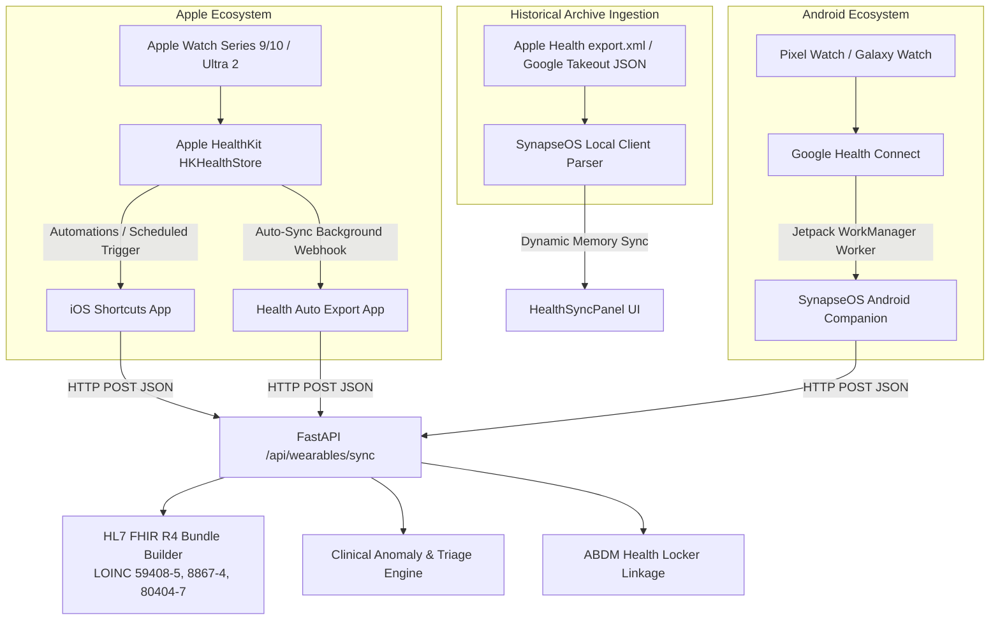

# ⌚ SynapseOS — Wearables & HealthKit Integration Specification

> **Notice**: Browser-based web applications (Next.js / React) cannot directly access sandboxed mobile device sensors (`HKHealthStore` on iOS or `HealthConnectClient` on Android) without a bridge. SynapseOS provides 4 production-grade integration pathways to stream and ingest real telemetry.

---

## 1. Architecture Overview



---

## 2. Ingestion Endpoint Specification

- **Endpoint**: `POST /api/wearables/sync`
- **Content-Type**: `application/json`

### JSON Request Payload Schema
```json
{
  "source": "ios_shortcut",
  "device_name": "Apple Watch Ultra 2",
  "patient_id": "PAT-91-4829",
  "patient_name": "Siddharth Sharma",
  "heart_rate_bpm": 74,
  "resting_heart_rate": 62,
  "spo2_percent": 98.5,
  "hrv_ms": 58,
  "respiratory_rate": 15,
  "steps": 8420,
  "ecg_classification": "Sinus Rhythm",
  "sleep_duration_hrs": 7.4
}
```

### Response Payload (FHIR R4 Compliant)
```json
{
  "status": "SYNCED",
  "source": "ios_shortcut",
  "device": "Apple Watch Ultra 2",
  "patient_id": "PAT-91-4829",
  "anomalies_detected": [],
  "clinical_flags": [],
  "risk_level": "Normal",
  "sync_timestamp": "2026-08-25T11:45:00.000000Z",
  "fhir_observation_count": 8,
  "fhir_bundle": {
    "resourceType": "Bundle",
    "id": "c71a39f1-d07c-4828-b0a7-0e69a918a221",
    "type": "collection",
    "total": 8,
    "entry": [
      {
        "resource": {
          "resourceType": "Observation",
          "code": {
            "coding": [{ "system": "http://loinc.org", "code": "59408-5", "display": "Oxygen saturation in Arterial blood by Pulse oximetry" }]
          },
          "valueQuantity": { "value": 98.5, "unit": "%", "code": "%" }
        }
      }
    ]
  },
  "abha_linked": true,
  "abha_id": "91-5829-3910-4821"
}
```

---

## 3. iOS Shortcuts Setup (Zero-Code iPhone Setup)

Follow these steps to push live Apple Health data directly from your iPhone without installing third-party apps:

### Step 1: Open Shortcuts App
1. Open the **Shortcuts** app on iOS.
2. Tap the **+** button to create a new Shortcut named **"SynapseOS Sync"**.

### Step 2: Add Health Actions
1. Add action **"Find Health Samples"**:
   - Type: `Heart Rate` | Sort by: `Start Date` (Latest First) | Limit: `1 sample`
2. Add action **"Find Health Samples"**:
   - Type: `Oxygen Saturation` | Sort by: `Start Date` (Latest First) | Limit: `1 sample`
3. Add action **"Find Health Samples"**:
   - Type: `Step Count` | Limit: `Today's Sum`

### Step 3: Add Dictionary & Webhook Action
1. Add action **"Dictionary"**:
   - `source`: `ios_shortcut`
   - `device_name`: `Apple Watch`
   - `heart_rate_bpm`: `[Sample Value of Heart Rate]`
   - `spo2_percent`: `[Sample Value of Oxygen Saturation * 100]`
   - `steps`: `[Sample Value of Steps]`
2. Add action **"Get Contents of URL"**:
   - URL: `https://<YOUR_SYNAPSEOS_SERVER_IP>:8000/api/wearables/sync`
   - Method: `POST`
   - Headers: `Content-Type: application/json`
   - Request Body: `Dictionary`

### Step 4: Schedule Automation
1. Navigate to the **Automation** tab in Shortcuts.
2. Tap **New Automation** -> **Time of Day** -> Select **Hourly** or **When Waking Up**.
3. Set action to run **"SynapseOS Sync"** automatically in the background.

---

## 4. Alternative: Health Auto Export (App Store)

If you prefer a pre-built iOS background sync utility:
1. Install **Health Auto Export** from the App Store.
2. Under **Sync Options**, choose **REST API / Webhook**.
3. Set URL to `https://<YOUR_SYNAPSEOS_SERVER_IP>:8000/api/wearables/sync`.
4. Set Cadence to **Background Sync (15-60 min)**.

---

## 5. Android Health Connect (Kotlin Bridge Snippet)

```kotlin
// Android Jetpack Health Connect Reader
val healthConnectClient = HealthConnectClient.getOrCreate(context)

suspend fun syncVitalsToSynapseOS() {
    val startTime = Instant.now().minus(Duration.ofHours(1))
    val endTime = Instant.now()
    
    val hrResponse = healthConnectClient.readRecords(
        ReadRecordsRequest(
            recordType = HeartRateRecord::class,
            timeRangeFilter = TimeRangeFilter.between(startTime, endTime)
        )
    )
    val spo2Response = healthConnectClient.readRecords(
        ReadRecordsRequest(
            recordType = OxygenSaturationRecord::class,
            timeRangeFilter = TimeRangeFilter.between(startTime, endTime)
        )
    )

    val latestHR = hrResponse.records.lastOrNull()?.samples?.lastOrNull()?.beatsPerMinute
    val latestSpO2 = spo2Response.records.lastOrNull()?.percentage?.value

    // Send payload to SynapseOS
    val payload = JSONObject().apply {
        put("source", "google_health_connect")
        put("device_name", "Pixel Watch 3")
        put("heart_rate_bpm", latestHR)
        put("spo2_percent", latestSpO2)
    }

    HttpClient.post("https://api.synapseos.org/api/wearables/sync", payload)
}
```

---

## 6. Standardized FHIR R4 & LOINC Coding Reference

| Metric | LOINC Code | System | Display Description |
|---|---|---|---|
| **Pulse Oximetry (SpO2)** | `59408-5` | `http://loinc.org` | Oxygen saturation in Arterial blood by Pulse oximetry |
| **Heart Rate** | `8867-4` | `http://loinc.org` | Heart rate |
| **Resting Heart Rate** | `40443-4` | `http://loinc.org` | Resting heart rate |
| **HRV (SDNN / RMSSD)** | `80404-7` | `http://loinc.org` | R-R interval standard deviation |
| **Respiratory Rate** | `9279-1` | `http://loinc.org` | Respiratory rate |
| **Step Count** | `41950-7` | `http://loinc.org` | Number of steps in 24 hour Measured |
| **Sleep Duration** | `93832-4` | `http://loinc.org` | Sleep duration |
| **ECG Rhythm** | `11524-6` | `http://loinc.org` | EKG study (Single Lead I interpretation) |

---
<div align="center">

### 🔹 built with love by TEAM, AC-DC FOR SMART VIThackathon(SVH)-2026

</div>
