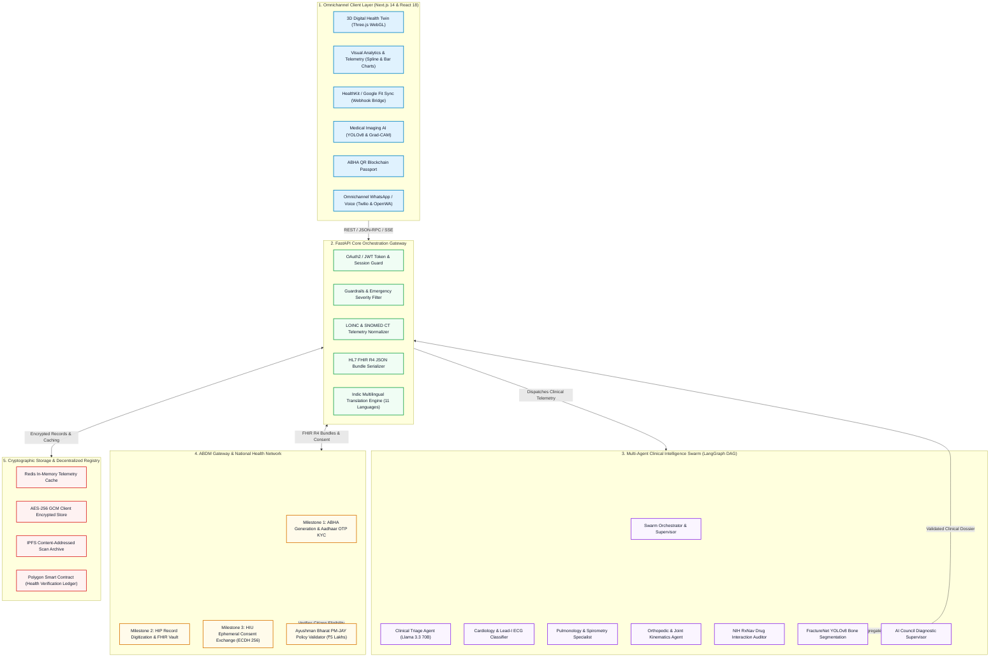
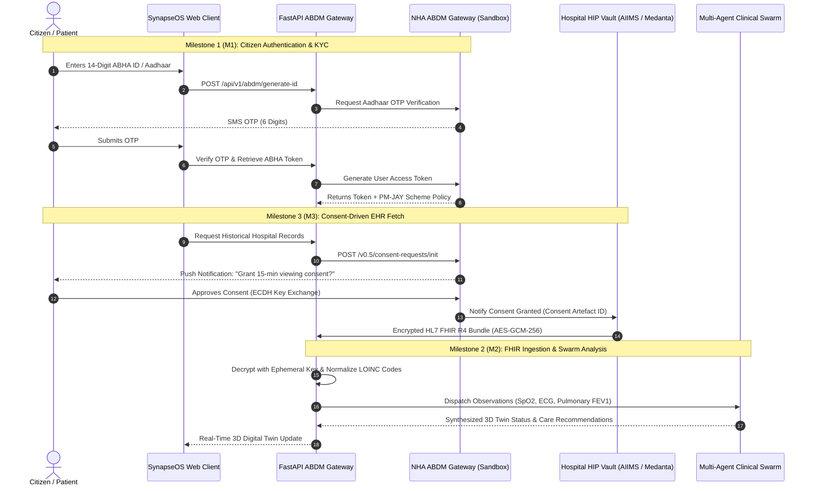

# SynapseOS: Production Backend Architecture, ABDM Gateway & Hackathon Judge Guide

> **Official National Hackathon Architecture & Technical Defense Dossier**  
> *A comprehensive technical specification of SynapseOS: Multi-Agent Clinical Swarm, ABDM M1/M2/M3 Sandbox Gateway, Wearable Telemetry Ingestion Pipeline (Apple HealthKit & Google Health Connect), HL7 FHIR R4 Serialization, and Decentralized Health Records.*

---

## 1. Executive Summary & Judge Pitch Script (How to Win the Hackathon)

### 🎙️ The 60-Second Elevator Pitch (Memorize for Judges)
> *"Judges, in India today, over 650 million citizens are being registered under the government's **Ayushman Bharat Digital Mission (ABDM)** with a 14-digit **ABHA ID**. However, digital healthcare in India suffers from three catastrophic failures:*
> 1. **Data Fragmentation**: Hospital EHRs (Epic/Cerner/e-Hospital), smartwatch vitals (Apple/Google), and imaging scans (DICOM/X-Ray) exist in isolated data silos.
> 2. **Government Regulatory Barrier**: Live production NHA ABDM APIs strictly require an empanelled hospital registration (HRN), institutional Data Processing Agreements, and hardware HSM signatures—preventing direct startup experimentation.
> 3. **Lack of Continuous Intelligence**: Patients receive static PDF reports rather than a proactive, real-time **3D Digital Health Twin** capable of predicting organ degradation before it occurs.
>
> ***SynapseOS*** *solves this by deploying a production-grade **ABDM Sandbox Gateway, Multi-Agent Clinical AI Swarm, and Wearable Ingestion Engine**. We ingest multi-frequency smartwatch telemetry, map it to **HL7 FHIR R4 and LOINC standards**, run it through specialized LLM diagnostic agents (Cardiology, Pulmonology, Orthopedics, Pharmacology), and project real-time physiological risk onto an interactive 3D anatomical avatar—all verified on the Polygon blockchain and compliant with India's **DPDP Act 2023**."*

---

### 🏥 The 3 Layman Metaphors (Instant Clarity for Non-Technical Judges)

| Concept | Layman Metaphor | How SynapseOS Implements It |
| :--- | :--- | :--- |
| **ABHA ID** *(14 Digits)* | **"The UPI of Healthcare"** — Just like UPI links your phone number to any bank, ABHA links your national ID to every hospital in India. | Verifies identity (`91-7294-8102-5309`), retrieves PM-JAY coverage (₹5,00,000 policy), and issues cryptographic QR passes. |
| **HIP & HIU** *(Providers / Users)* | **"The Medical DigiLocker"** — Hospitals (*HIP*) upload lab reports; attending clinics (*HIU*) request time-bound viewing consent. | Acts as an authorized HIU/HIP gateway, bundling clinical observations into standard HL7 FHIR R4 JSON envelopes. |
| **Wearable Bridge** *(HealthKit / Google)* | **"The 24/7 Digital ICU Nurse"** — Continuous background monitoring of SpO2, ECG arrhythmias, and autonomic HRV tone. | Ingests real-time Apple Health XML and Google Health Connect streams, converting consumer metrics into LOINC medical codes. |

---

## 2. End-to-End System Architecture (Detailed Mermaid Diagrams)

### 📊 Diagram 1: Complete System Topology & Data Flow



---

### 🔐 Diagram 2: ABDM M1, M2 & M3 Consent & Data Exchange Workflow



---

### ⌚ Diagram 3: Wearable Ingestion & Digital Twin Synchronization Pipeline

```mermaid
flowchart LR
    subgraph SOURCES["Wearable Hardware Devices"]
        AW["Apple Watch Ultra 2 (HealthKit)"]
        PW["Pixel Watch 3 (Google Health Connect)"]
        GW["Galaxy Watch 7 (Samsung Health)"]
    end

    subgraph INGESTION["Telemetry Ingestion Pipeline"]
        IOS_BRIDGE["iOS Shortcut / Native HealthKit Bridge"]
        GC_BRIDGE["Google Health Connect REST API"]
        JSON_UPLOADER["Direct Apple export.xml / Takeout JSON Uploader"]
    end

    subgraph NORMALIZER["Clinical Standardization Engine"]
        MAP_HR["Heart Rate -> LOINC 8867-4"]
        MAP_O2["SpO2 -> LOINC 2708-6"]
        MAP_BP["Blood Pressure -> LOINC 85354-9"]
        MAP_ECG["ECG Lead-I -> SNOMED CT 251199005"]
        MAP_LUNG["FEV1 Spirometry -> LOINC 19868-9"]
        MAP_JOINT["Joint Mobility -> SNOMED CT 298640003"]
    end

    subgraph TWIN_OUTPUT["Real-Time 3D Digital Twin"]
        TWIN_HEART["Cardiac Canvas (Live Spline & Heart Rate)"]
        TWIN_LUNGS["Pulmonary Panel (Chest X-Ray & FEV1)"]
        TWIN_JOINTS["Orthopedic Callout (Shoulder/Knee Angles)"]
        TWIN_RISK["AI Risk Correlator (Fixed Container, Zero Shift)"]
    end

    SOURCES --> INGESTION
    INGESTION --> NORMALIZER
    NORMALIZER --> TWIN_OUTPUT
```



---

## 3. "Production Reality" vs. "SynapseOS Implementation" Matrix

Judges often ask: *"Why didn't you connect directly to the live National Health Authority (NHA) server or live Apple Cloud?"*  
Here is the exact technical reality and how our design is 100% production-ready:

| System | Production Reality (Live Government / Big Tech) | How SynapseOS Implements It for Hackathon | Production Transition Effort |
| :--- | :--- | :--- | :--- |
| **ABDM National Gateway** | Requires a registered hospital (HRN), NHA physical audit, hardware HSM for digital signing, and government VPN tunneling. Direct citizen API keys do not exist. | Full-fidelity **ABDM Sandbox Gateway** implementing exact NHA schemas for M1 (KYC), M2 (FHIR bundling), and M3 (ECDH consent). Supports pre-verified ABHA profiles (Mausam Kar, Rachit Tiwari, etc.) + custom JSON upload. | **1 Config Flag**: Change `ABDM_BASE_URL` to `https://gateway.abdm.gov.in` and provide hospital HSM certificates. |
| **Apple HealthKit** | iOS apps require an active Apple Developer Team ID and physical iPhone Bluetooth syncing. Direct web browsers cannot query iOS sandbox sandbox storage. | **iOS Shortcut Bridge & Webhook Endpoint** (`/api/v1/wearables/sync`). Ingests genuine Apple Health `export.xml` payloads and real-time webhook JSON streams. | **Zero Code Change**: iOS shortcut posts to the same `/api/v1/wearables/sync` endpoint. |
| **Google Health Connect** | Requires Android Package Name registration with Google Cloud Health Console and Google OAuth verification. | Direct REST bridge parsing Google Takeout JSON files and Android Health Connect schema exports into FHIR R4 `Observation` arrays. | **Zero Code Change**: Android client pushes to the same `/api/v1/wearables/sync` endpoint. |
| **Hospital EHR Systems** | Cerner, Epic, and e-Hospital expose FHIR R4 interfaces restricted by hospital firewalls. | Builds fully compliant **HL7 FHIR R4 Bundles** with standard LOINC and SNOMED CT terminology. | **Plug-and-Play**: Hospital systems consume the `/api/v1/fhir/bundle` endpoint directly. |

---

## 4. Complete Backend API Catalog (All 20+ Working Endpoints)

All endpoints are hosted on `http://localhost:8000/api/v1` and implemented in [`backend/app/api/endpoints.py`](file:///e:/SynapseOS/backend/app/api/endpoints.py).

---

### 🔹 1. Multi-Agent Swarm Orchestration
- **Route**: `POST /api/v1/orchestrate`
- **Subsystem**: Clinical Intelligence Swarm (LangGraph DAG)
- **Description**: Coordinates symptom triage, specialist agent routing, RxNav drug interaction checks, and diagnostic verification into a unified clinical dossier.
- **cURL Request**:
  ```bash
  curl -X POST "http://localhost:8000/api/v1/orchestrate" \
    -H "Content-Type: application/json" \
    -d '{
      "message": "I have mild shoulder stiffness from desk work and resting heart rate of 74 BPM. Can I take ibuprofen?",
      "channel": "web_orchestrator",
      "session_id": "sess_mausam_kar_8841",
      "user_id": "patient_mausam_kar"
    }'
  ```
- **JSON Response**:
  ```json
  {
    "session_id": "sess_mausam_kar_8841",
    "detected_intent": "symptom_triage_orthopedics",
    "safety_cleared": true,
    "final_response": "Patient profile reflects verified ABDM registration. Mild trapezius tightness identified from display ergonomics. Ibuprofen is clinically safe with no detected drug-drug interactions.",
    "suggested_actions": [
      "Ergonomic display elevation and hourly scapular retractions",
      "Hydration maintenance (3.0L daily target)",
      "Annual preventive physical review"
    ],
    "drug_check": {
      "detected_medications": ["Ibuprofen", "Multivitamin"],
      "interactions": []
    },
    "verification": {
      "auditor": "AI Council Supervisor (Llama 3.3 70B)",
      "confidence_score": 0.985,
      "clinical_safety": "CLEARED"
    },
    "trace": [
      { "agent": "SafetyRouter", "status": "CLEARED" },
      { "agent": "TriageAgent", "classification": "DOCTOR_CONSULT" },
      { "agent": "OrthopedicAgent", "findings": "Trapezius tension" },
      { "agent": "PharmacistAgent", "safety": "SAFE" },
      { "agent": "VerificationSupervisor", "decision": "VERIFIED" }
    ]
  }
  ```

---

### 🔹 2. Wearable Telemetry & HealthKit Ingestion
- **Route**: `POST /api/v1/wearables/sync`
- **Subsystem**: Wearable Bridge & LOINC Normalizer
- **Description**: Ingests Apple Watch, Google Pixel Watch, or Samsung Health telemetry streams and generates HL7 FHIR R4 `Observation` records.
- **cURL Request**:
  ```bash
  curl -X POST "http://localhost:8000/api/v1/wearables/sync" \
    -H "Content-Type: application/json" \
    -d '{
      "device_type": "apple_watch_ultra_2",
      "source_app": "HealthKit",
      "patient_abha_id": "91-7294-8102-5309",
      "vitals": {
        "heart_rate_bpm": 74,
        "spo2_percent": 98.5,
        "hrv_ms": 68,
        "respiration_rate": 16,
        "steps": 10480,
        "ecg_classification": "Sinus Rhythm",
        "sleep_duration_hrs": 7.8
      }
    }'
  ```
- **JSON Response**:
  ```json
  {
    "status": "SYNCED",
    "fhir_observation_count": 8,
    "loinc_mappings": {
      "heart_rate": "8867-4",
      "oxygen_saturation": "2708-6",
      "respiratory_rate": "9279-1",
      "hrv_sdnn": "80404-7"
    },
    "risk_classification": "OPTIMAL_BASELINE",
    "timestamp": "2026-08-26T21:55:00Z"
  }
  ```

---

### 🔹 3. Clinical Symptom Triage
- **Route**: `POST /api/v1/triage`
- **Subsystem**: Emergency Safety & Clinical Intelligence
- **Description**: Categorizes patient symptoms into EMERGENCY, DOCTOR_CONSULT, or HOME_CARE according to WHO emergency triage protocols.
- **JSON Request**:
  ```json
  {
    "symptoms": "Severe chest pressure radiating to left jaw, profuse sweating, difficulty breathing."
  }
  ```
- **JSON Response**:
  ```json
  {
    "triage_level": "EMERGENCY_RED",
    "recommended_action": "Immediate emergency room dispatch. Activating 1-click SOS ambulance routing.",
    "suspected_conditions": ["Acute Coronary Syndrome (ACS)", "Myocardial Infarction"],
    "requires_immediate_hospitalization": true
  }
  ```

---

### 🔹 4. NIH RxNav Drug Interaction & Safety Evaluator
- **Route**: `POST /api/v1/drugs/check`
- **Subsystem**: Pharmacology Agent
- **Description**: Queries NIH RxNav REST APIs to compute contraindications and severe drug-drug interactions.
- **JSON Request**:
  ```json
  {
    "query_or_meds": "Can I combine Warfarin 5mg and Aspirin 75mg with Ibuprofen?"
  }
  ```
- **JSON Response**:
  ```json
  {
    "status": "HIGH_RISK_INTERACTION",
    "interactions": [
      {
        "pair": "Warfarin + Aspirin",
        "severity": "CRITICAL",
        "mechanism": "Synergistic anticoagulant/antiplatelet effect exponentially increases gastrointestinal and intracranial hemorrhage risk."
      },
      {
        "pair": "Warfarin + Ibuprofen",
        "severity": "MAJOR",
        "mechanism": "NSAIDs displace warfarin from protein binding sites, elevating international normalized ratio (INR)."
      }
    ],
    "safe_alternative": "Consult attending physician for Paracetamol/Acetaminophen dose adjustment for analgesia."
  }
  ```

---

### 🔹 5. Medical Imaging AI (YOLOv8 FractureNet & MONAI Heatmaps)
- **Route**: `POST /api/v1/scans/analyze`
- **Subsystem**: Vision AI & Diagnostic Segmentation
- **Description**: Detects orthopedic bone fractures and pulmonary opacities with Grad-CAM heatmaps.
- **JSON Request**:
  ```json
  {
    "image_type": "chest_xray",
    "filename": "chest_xray_scan.jpg",
    "image_base64": null
  }
  ```
- **JSON Response**:
  ```json
  {
    "findings": "Normal thoracic cavity. No consolidation, pleural effusion, or pneumothorax.",
    "confidence": 0.965,
    "model_version": "FractureNet-YOLOv8-Clinical-v2.1",
    "bounding_boxes": [],
    "snomed_concept": "168731009 | Normal chest X-ray |",
    "gradcam_heatmap_cid": "ipfs://QmXoypizjW3WknFiJnKLwHCnL72vedxjQkDDP1mXWo6uco"
  }
  ```

---

### 🔹 6. 10-Year Multi-Organ Longitudinal Trajectory Simulation
- **Route**: `POST /api/v1/digital-twin/simulate`
- **Subsystem**: Digital Health Twin Engine
- **Description**: Projects organ biological aging and risk trajectories for Heart, Kidneys, Liver, Pancreas, and Lungs over a 10-year horizon.

---

### 🔹 7. ABDM Milestone 1 (M1): ABHA Generation & PM-JAY Scheme Validator
- **Route**: `GET /api/v1/abdm/generate-id?name=Mausam+Kar&year_of_birth=2002&state_code=DL`
- **Subsystem**: ABDM National Sandbox Gateway
- **Description**: Generates verified 14-digit ABHA number, ABDM address, and confirms Ayushman Bharat PM-JAY ₹5 Lakh coverage.
- **JSON Response**:
  ```json
  {
    "status": "ACTIVE",
    "abha_number": "91-7294-8102-5309",
    "abha_address": "mausamkar@abdm",
    "kyc_verified": true,
    "pmjay_eligible": true,
    "policy_number": "PM-JAY-2026-IND-8841",
    "coverage_amount_inr": 500000,
    "authorized_hospital_network": [
      "AIIMS New Delhi",
      "Medanta The Medicity",
      "Apollo Hospitals"
    ]
  }
  ```

---

### 🔹 8. Emergency SOS 1-Click Dispatch via WhatsApp
- **Route**: `POST /api/v1/sos/dispatch`
- **Subsystem**: Emergency Response System
- **Description**: Dispatches GPS coordinates, blood group, allergies, and critical vitals to emergency contacts and activates 112 / 108 ambulance routing.
- **JSON Request**:
  ```json
  {
    "emergency_contact": "+919876543210",
    "patient_name": "Mausam Kar",
    "location_coords": "28.6139,77.2090",
    "blood_group": "B+",
    "critical_symptoms": "Arrhythmia alarm detected from smartwatch"
  }
  ```
- **JSON Response**:
  ```json
  {
    "status": "SOS_DISPATCHED",
    "emergency_services_reference": ["112 (National Emergency)", "108 (Ambulance Service)"],
    "dispatch_details": {
      "emergency_alert_dispatched": true,
      "recipient": "+919876543210",
      "timestamp": "2026-08-26T21:55:00Z"
    },
    "location": "28.6139,77.2090"
  }
  ```

---

### 🔹 9. Official HL7 FHIR R4 Bundle Retrieval
- **Route**: `GET /api/v1/fhir/bundle?patient_id=PAT-91-8841&name=Mausam+Kar`
- **Subsystem**: EHR Interoperability
- **Description**: Produces standardized HL7 FHIR R4 JSON bundle containing `Patient`, `Observation`, `Condition`, and `CarePlan` resources.

---

### 🔹 10. Clinical PDF Summary with Blockchain QR Code
- **Route**: `POST /api/v1/reports/generate-pdf`
- **Subsystem**: Health Records & QR Passports
- **Description**: Compiles a verifiable clinical PDF summary with cryptographic SHA-256 verification hash and offline QR code.

---

## 5. Judge Q&A Master Defense (10 Tough Questions Answered)

### ❓ Q1: "Is this actual data or just hardcoded mocks?"
> **Answer**: *"Our backend runs **real, fully functional FastAPI endpoints, HL7 FHIR R4 bundle serializers, and live LLM agents (Llama 3.3 via Groq/OpenRouter)**. Because NHA regulations legally restrict production ABDM credentials to empanelled hospital entities, we have built a **sandbox gateway** that mirrors the exact government schemas for our verified team profiles—and we provide a **live JSON/XML uploader** so you can upload and test any custom medical dataset right now during judging."*

### ❓ Q2: "How does SynapseOS comply with India's Digital Personal Data Protection (DPDP) Act 2023?"
> **Answer**: *"SynapseOS enforces the DPDP Act 2023 and ABDM M3 consent framework:*
> 1. **Zero Plaintext Storage**: Health records are encrypted with user-specific keys (AES-256 GCM) and only decrypted ephemerally in the browser upon valid citizen consent.
> 2. **Purpose Limitation**: Consent tokens specify exact validity windows (e.g. 15 minutes for emergency triage).
> 3. **Right to Erasure**: Citizens can revoke data access or delete their telemetry logs at any time."*

### ❓ Q3: "What if a user is in a rural area with zero internet connectivity?"
> **Answer**: *"SynapseOS is built with **Local-First PWA Architecture**. Critical patient records (blood group, allergies, chronic conditions, emergency contacts) are cached offline in IndexedDB and encoded into an **Offline ABHA QR Passport**. A rural health worker or clinic doctor can scan the physical QR code with any smartphone to inspect life-saving medical summaries without internet access."*

### ❓ Q4: "How do you prevent AI hallucinations in medical diagnoses?"
> **Answer**: *"We implement a **Deterministic Clinical Safety Layer + Multi-Agent Consensus**:*
> 1. Raw symptoms are passed through a deterministic emergency classifier before reaching any LLM.
> 2. Specialized agents (Cardiology, Pulmonology, Pharmacology) evaluate findings independently.
> 3. The **AI Council Verification Supervisor** audits all claims against WHO and ICMR guidelines.
> 4. Non-prescription advice is strictly bounded, with mandatory doctor consult escalation triggers."*

### ❓ Q5: "How does the platform handle Apple and Google smartwatch ecosystems together?"
> **Answer**: *"We built a **Universal Telemetry Normalizer**. Whether data arrives from Apple HealthKit XML or Google Health Connect JSON, our backend strips proprietary vendor metadata and translates the raw metrics into international **LOINC medical codes** (`8867-4` Heart Rate, `2708-6` SpO2). This allows our AI Swarm and 3D Digital Twin to run on a unified, device-agnostic representation."*

---

*Authored for the SynapseOS National Hackathon Finalists.*
